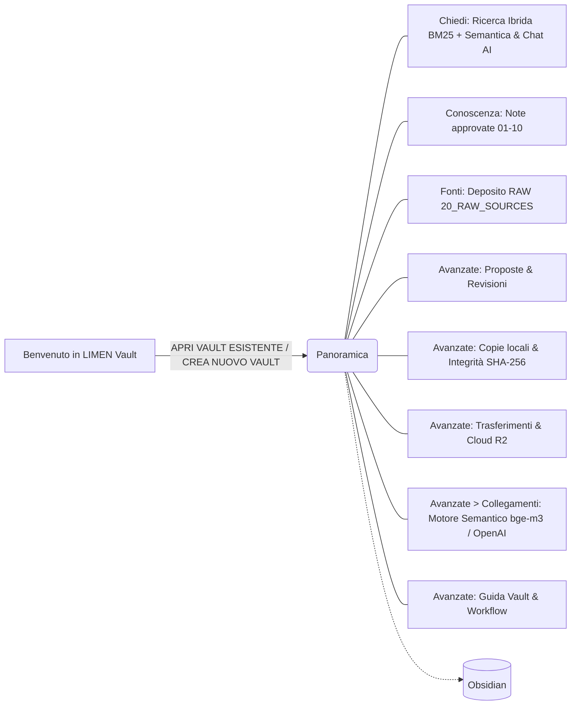

# LIMEN Vault v3 (0.3.0) — Guida, Help e Tutorial

Documentazione ufficiale per l'utente dell'app macOS **LIMEN Vault v3 (0.3.0)** (Tauri, interfaccia italiana).
Aggiornata il 20 settembre 2026 con il **RAG 100% Locale (bge-m3)**, la **Ricerca Ibrida BM25 con normalizzazione sulla lunghezza**, il pannello **«Motore semantico»** e la **Modalità Degradata automatica**.

| File | A cosa serve | Quando leggerlo |
| --- | --- | --- |
| [[07_AUTOMAZIONE_DOCUMENTI]] | Caricare originali in `20_RAW_SOURCES`, estrazione OCR e wiki | Uso quotidiano |
| [[01_GUIDA_RAPIDA]] | Partire in 4 passi (inclusa configurazione RAG Locale) | Primo giorno |
| [[02_TUTORIAL_COMPLETO]] | Esercitazione guidata su un Vault di prova, dall'apertura alla pubblicazione | Formazione |
| [[03_HELP_SCHERMATE]] | Riferimento completo di ogni schermata: Ricerca Ibrida, Motore Semantico, pulsanti, stati | Quando un elemento non è chiaro |
| [[04_WORKFLOW]] | Tutti i flussi di lavoro con diagrammi Mermaid (inclusi W15–W18 per RAG e cache) | Per capire "cosa viene prima di cosa" |
| [[05_PROBLEMI_E_GLOSSARIO]] | Diagnostica guasti, banner modalità degradata, log servizio, glossario tecnico | Quando qualcosa non funziona |
| [[06_NOTE_AUDIT_DOCUMENTAZIONE]] | Discrepanze e tracciamento storico delle versioni | Per chi mantiene l'app |

## Requisiti e Garanzia Rete Zero

- Mac Apple Silicon con macOS 14.0 o successivo (architettura ARM64 ottimizzata).
- **Rete Zero per il RAG Locale**: l'indicizzazione lessicale BM25 e il calcolo dei vettori semantici `bge-m3` (1024 dimensioni) tramite `llama-server` avvengono **al 100% offline sul Mac** (connessione limitata al loopback `127.0.0.1`, zero byte verso l'esterno).
- Servono connessione internet e credenziali solo per le funzioni generative esterne facoltative (OpenAI per *Chiedi al Vault* e classificazione wiki) e per i *Trasferimenti* cloud R2.

## Mappa dell'app

## Quattro regole da ricordare sempre

1. **Carica gli originali: LIMEN organizza.** Dopo la configurazione, estrazione testo nativa con OCR, segmentazione in passaggi, classificazione e indicizzazione sono automatiche.
2. **Il RAG Locale opera a Rete Zero.** Con il fornitore Locale nessun documento né vettore lascia mai il Mac. Se il servizio si arresta, la ricerca continua in **Modalità Degradata** (solo lessicale BM25) esponendo un chiaro banner giallo di avviso senza mai bloccarsi.
3. **Automatico non significa approvato da una persona.** Le note generate nelle categorie 01–09 restano `review`, sono consultabili con provenienza verificata e non sovrascrivono le modifiche umane.
4. **Approvare non significa pubblicare.** Il CRM riceve soltanto la selezione pubblicata esplicitamente; il caricamento RAW non pubblica nulla.
