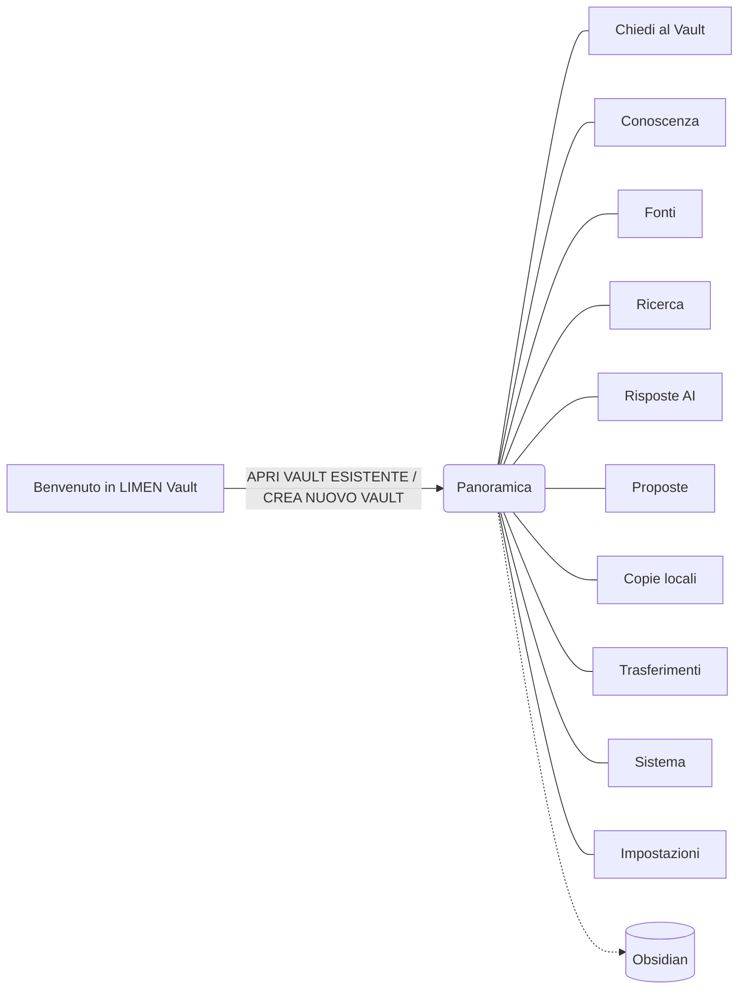

# LIMEN Vault 0.2.0 — Guida, Help e Tutorial

Documentazione per l'utente dell'app macOS **LIMEN Vault 0.2.0** (Tauri, interfaccia italiana).
Tutti i nomi di pulsanti, sezioni e messaggi sono stati ricontrollati sul codice sorgente
(`apps/desktop/src/*.tsx`, `apps/desktop/src-tauri/src/*.rs`) il 16 settembre 2026.

| File | A cosa serve | Quando leggerlo |
| --- | --- | --- |
| [[01_GUIDA_RAPIDA]] | Partire in 10 passi | Primo giorno |
| [[02_TUTORIAL_COMPLETO]] | Esercitazione guidata su un Vault di prova, dall'apertura alla pubblicazione | Formazione |
| [[03_HELP_SCHERMATE]] | Riferimento di ogni sezione: campi, pulsanti, stati | Quando un pulsante non è chiaro |
| [[04_WORKFLOW]] | Tutti i flussi di lavoro con diagrammi Mermaid | Per capire "cosa viene prima di cosa" |
| [[05_PROBLEMI_E_GLOSSARIO]] | Messaggi di errore, soluzioni, glossario | Quando qualcosa non funziona |
| [[06_NOTE_AUDIT_DOCUMENTAZIONE]] | Discrepanze trovate tra codice e documenti esistenti | Per chi mantiene l'app |

## Requisiti in una riga

Mac Apple Silicon con macOS 26.3 o successivo (valore `minimumSystemVersion` in `tauri.conf.json`).
Il lavoro locale non richiede rete. Servono rete e credenziali solo per OpenAI, ChatGPT Business
e Trasferimenti cloud.

## Mappa dell'app

## Tre regole da ricordare sempre

1. **LIMEN legge, Obsidian scrive.** Le note si scrivono in Obsidian; LIMEN consulta, compila, cerca, verifica e approva.
2. **L'AI non scrive mai nella conoscenza approvata.** Può scrivere solo in `80_AI_OUTPUTS` e `90_PROPOSALS`. Una nota entra in `01`–`10` solo dopo la tua approvazione esplicita in **Proposte**.
3. **Approvare non vuol dire pubblicare.** Per rendere una nota visibile nel CRM serve **Trasferimenti → Pubblica conoscenza**.
