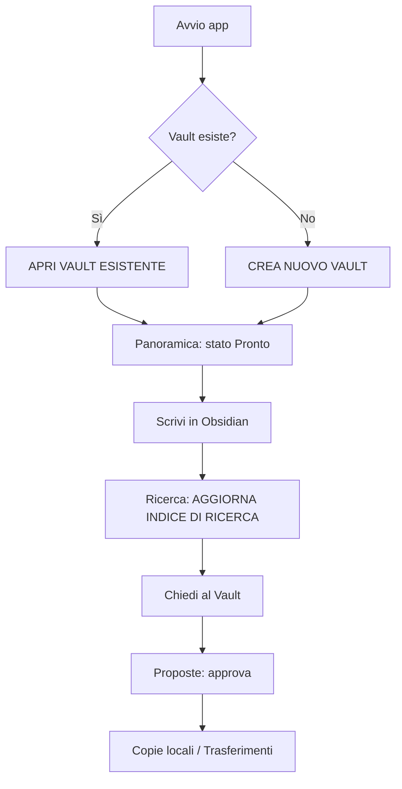

# Guida rapida (10 passi)

Torna all'indice: [[00_INDICE]]

1. **Avvia l'app** LIMEN Vault 0.2.0 dalla cartella Applicazioni dell'utente.
   Se vedi "Modalità anteprima nel browser" non sei nell'app nativa: le operazioni sui file non sono disponibili.
2. **Scegli il Vault.** Nella schermata *Benvenuto in LIMEN Vault*, campo **Percorso del Vault (cartella locale)**:
   - Vault già esistente (es. `/Users/cesare/Documents/VAULT`) → **APRI VAULT ESISTENTE**.
   - Vault nuovo, in una cartella inesistente o vuota → **CREA NUOVO VAULT**.
3. **Controlla la Panoramica.** Lo stato atteso è *Pronto*. Guarda le quattro schede: File Markdown, Fonti originali, File delle proposte, Integrità SHA-256.
4. **Apri in Obsidian** (pulsante sotto il menu). Al primo utilizzo Obsidian chiede di registrare la cartella: *Open folder as vault* → seleziona la cartella → torna in LIMEN e premi di nuovo **Apri in Obsidian**.
5. **Scrivi le note in Obsidian** nella cartella giusta (`01_CLIENTS`, `02_PROJECTS`, …). Documenti grezzi in `20_RAW_SOURCES`.
6. **Aggiorna l'indice**: sezione **Ricerca** → **AGGIORNA INDICE DI RICERCA**. Va rifatto dopo ogni modifica, salvataggio AI o approvazione.
7. **Configura OpenAI** (facoltativo): **Impostazioni** → campo *Chiave API OpenAI* → **SALVA CHIAVE** → **VERIFICA PORTACHIAVI**.
8. **Fai una domanda**: **Chiedi al Vault** → modello → domanda → **ANTEPRIMA FONTI** → controlla → **INVIA A OPENAI LE FONTI MOSTRATE**.
9. **Approva la conoscenza**: **Proposte** → apri la proposta → indica la destinazione `.md` → spunta la conferma → **APPROVA REVISIONE MOSTRATA**.
10. **Metti al sicuro**: **Copie locali** → **CREA COPIA LOCALE**. Per il CRM: **Trasferimenti** → **Pubblica conoscenza**.

## Dove va ogni file

| Stai inserendo… | Cartella |
| --- | --- |
| Documenti grezzi, trascrizioni, brief, appunti | `20_RAW_SOURCES` |
| Schede clienti | `01_CLIENTS` |
| Schede progetto | `02_PROJECTS` |
| Marchi | `03_BRANDS` |
| Posizionamento | `04_POSITIONING` |
| Conoscenza tecnica packaging | `05_PACKAGING_KNOWLEDGE` |
| Metodi e checklist | `06_METHODS` |
| Casi studio | `07_CASE_STUDIES` |
| Ricerche di mercato | `08_MARKET_RESEARCH` |
| Concorrenti | `09_COMPETITORS` |
| Contenuti definitivi approvati | `10_APPROVED_OUTPUTS` (preferibilmente tramite Proposte) |
| (solo AI) risposte salvate | `80_AI_OUTPUTS` |
| (solo AI / compilatore) bozze e proposte | `90_PROPOSALS` |
| Archivio | `99_ARCHIVE` |
| Sistema — non toccare | `00_SYSTEM` |

I nomi delle cartelle e delle proprietà (`client`, `status: approved`…) **non vanno tradotti**.
