# Workflow utente

Torna all'indice: [[00_INDICE]]

I diagrammi usano Mermaid e si vedono direttamente in Obsidian.

---

## W0 — Il ciclo di vita di un contenuto

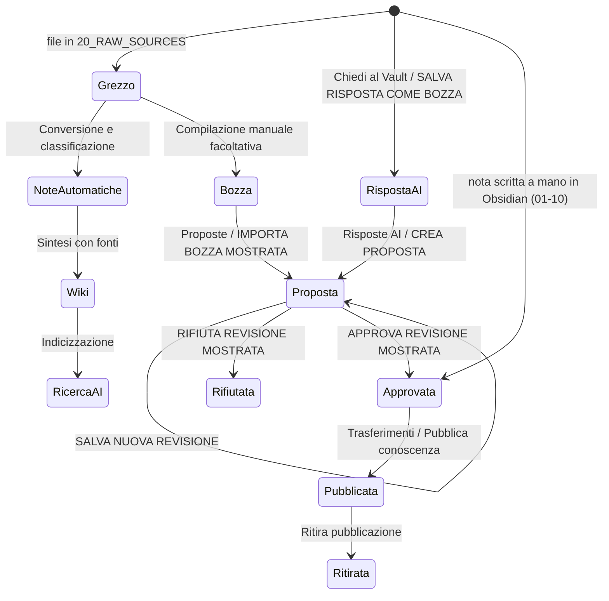

## W0b — Chi può scrivere dove

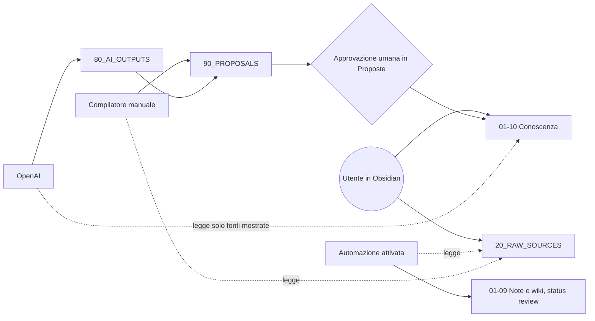

---

## W1 — Primo avvio

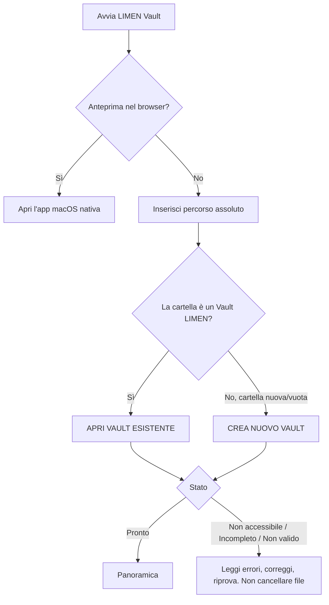

## W2 — Collegare Obsidian

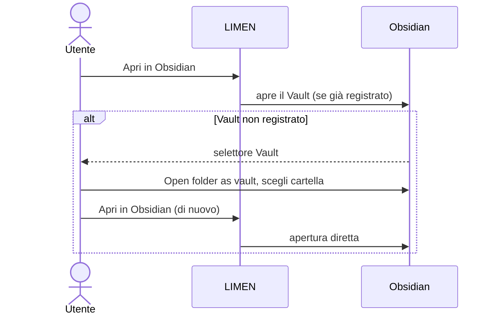

## W3 — Scrivere una nota e ritrovarla

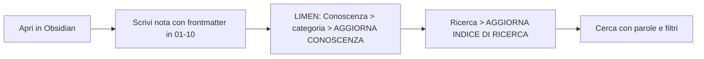

## W4 — Percorso manuale facoltativo da testo a conoscenza approvata

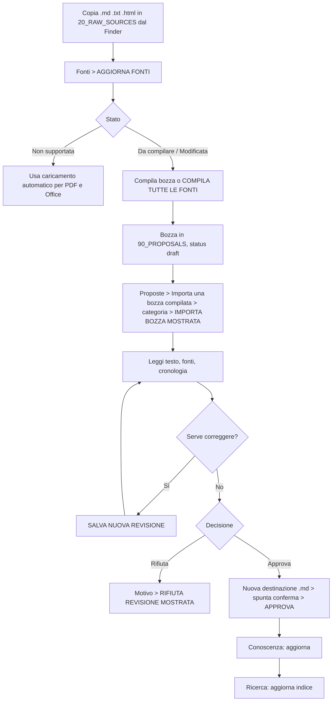

## W5 — Domanda AI con controllo delle fonti

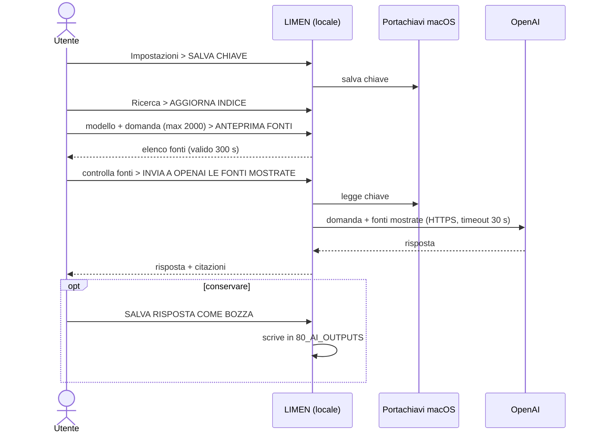

## W6 — Da risposta AI a nota approvata

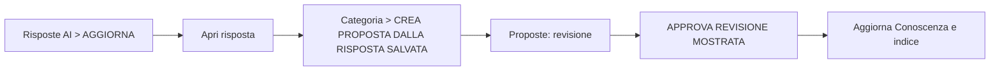

## W7 — Copie locali e integrità

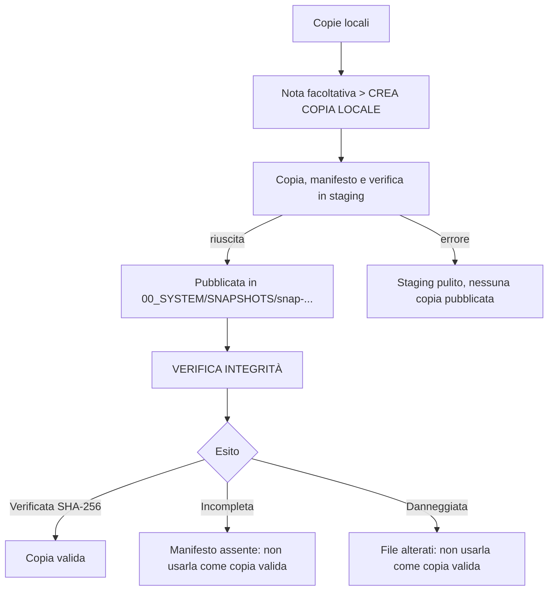

## W8 — Collegare il cloud

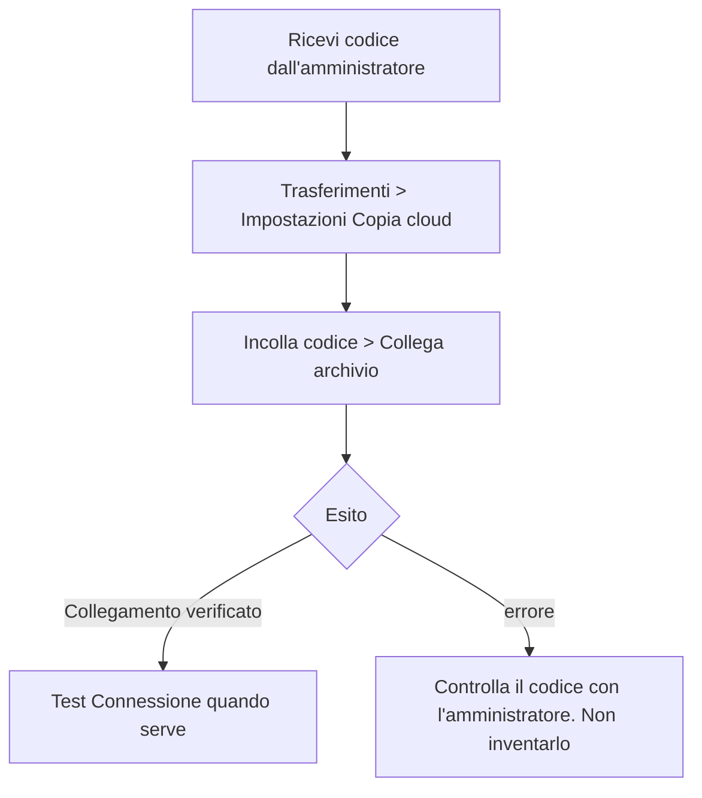

## W9 — Pubblicare nel CRM

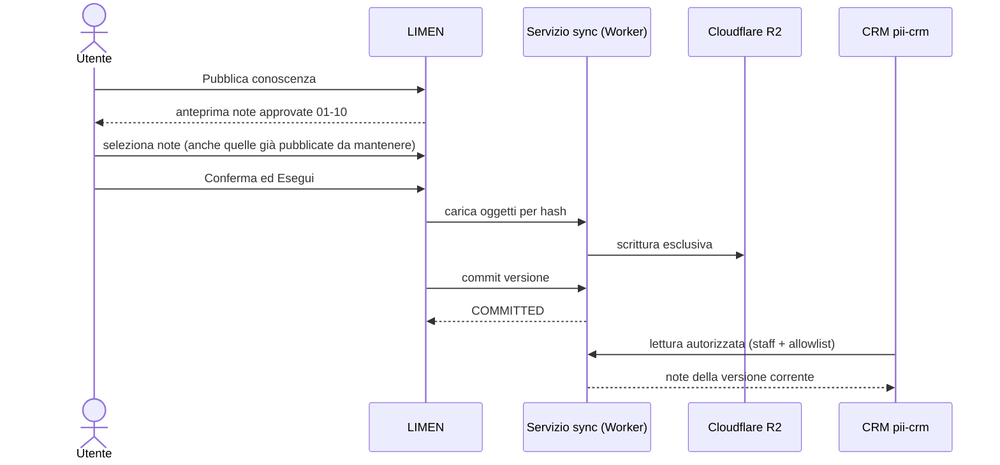

Mapping Cliente/Progetto: i campi `client` e `project` della nota devono contenere gli **identificativi CRM esatti**. Il nome visibile non viene convertito. Falli confermare all'amministratore.

## W10 — Copia privata e recupero

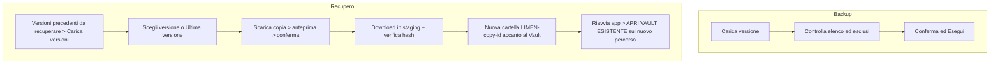

## W11 — Interruzioni e conflitti

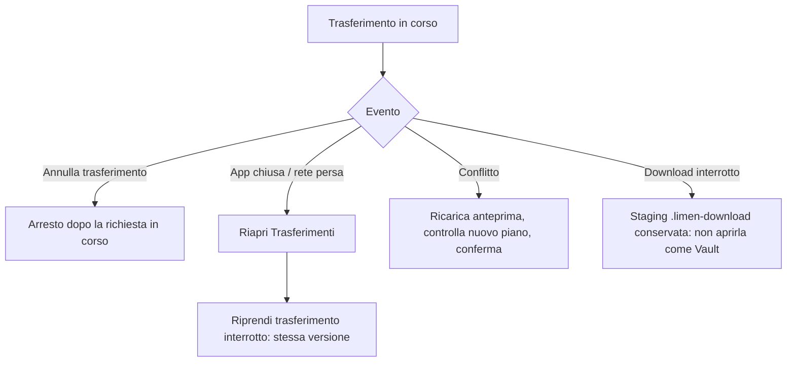

## W12 — Ritirare una pubblicazione

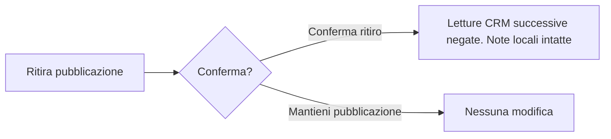
Il ritiro non cancella copie già scaricate da altri. **Disconnetti** è un'altra cosa: toglie solo il collegamento da questo Mac.

## W13 — Codex / client MCP

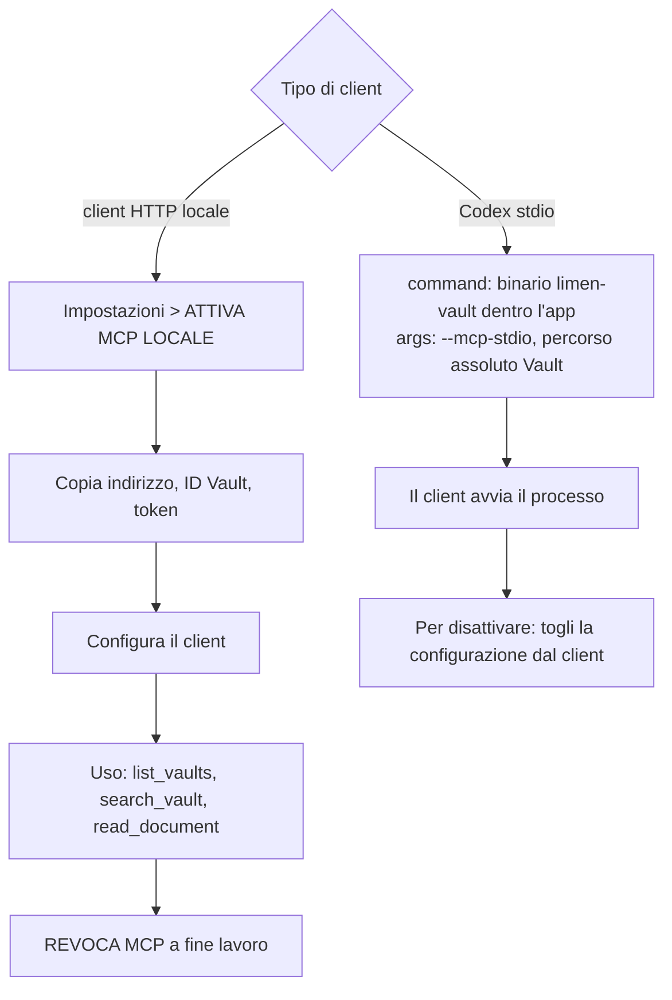

Il binario accetta esattamente due argomenti: `--mcp-stdio` e il percorso del Vault (`main.rs`).
Il percorso del binario dentro l'app va verificato sul Mac (vedi [[06_NOTE_AUDIT_DOCUMENTAZIONE]]).

## W14 — ChatGPT Business

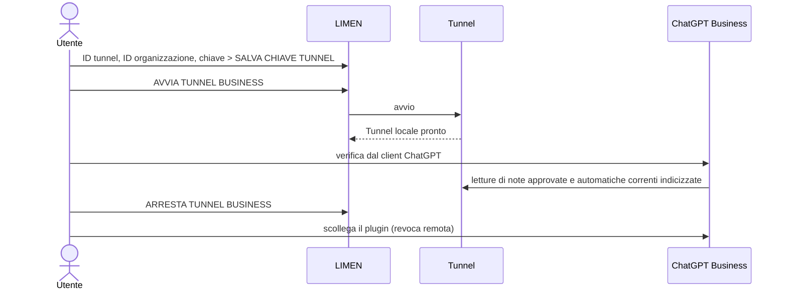

## W15 — Aggiornare l'app

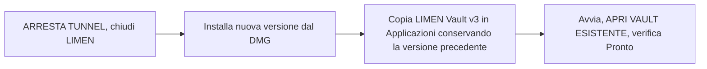
Il Vault resta fuori dall'app. Rimuovere l'app non cancella il Vault né le chiavi nel Portachiavi.

## W16 — Flusso quotidiano automatico

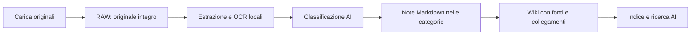

Una configurazione iniziale autorizza le chiamate automatiche; LIMEN deve restare aperta. Dettagli: [[07_AUTOMAZIONE_DOCUMENTI]].
