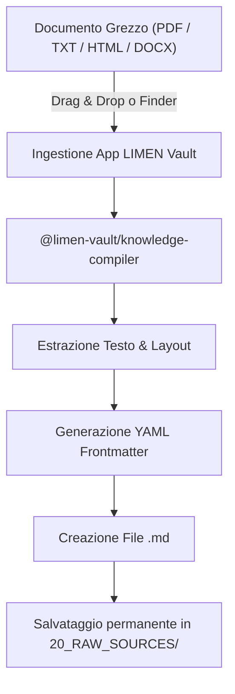
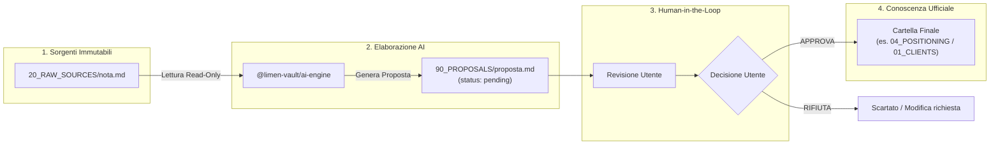

# 📘 LIMEN Vault — Manuale Utente Completo

> **Sistema di Conoscenza Local-First Indipendente per Packaging in Italy**

Benvenuto nel **Manuale Utente Ufficiale di LIMEN Vault** (MEMAI Fallback Obsidian). Questo manuale guida l'utente e il team nella gestione, organizzazione ed elaborazione della conoscenza aziendale in modalità completamente **local-first** e sicura.

---

## 📂 1. Guida alla Scelta della Sottocartella

L'utente (o il consulente) deposita i file Markdown (`.md`) nella cartella appropriata a seconda del tipo di contenuto:

### 📥 Se stai inserendo materiale di partenza grezzo:
* **`20_RAW_SOURCES/`**: Inserisci qui tutti i documenti di input grezzi, trascrizioni di chiamate, appunti non strutturati, brief iniziali o estratti.
  * *Perché?* Questo è l'hub in cui il motore AI legge i materiali per elaborare le sintesi senza modificare mai i file originali.

### 🏢 Se stai inserendo conoscenza organizzata e strutturata:
* **`01_CLIENTS/`**: Profili e schede dei clienti (es. `cliente-acme.md`).
* **`02_PROJECTS/`**: Schede di progetto e deliverable (es. `progetto-restyling-2026.md`).
* **`03_BRANDS/`**: Brand del cliente o analisi dei marchi (es. `brand-identity-xyz.md`).
* **`04_POSITIONING/`**: Strategie e framework di posizionamento.
* **`05_PACKAGING_KNOWLEDGE/`**: Conoscenza tecnica su materiali, strutture, imballaggi e sostenibilità.
* **`06_METHODS/`**: Metodologie operative e checklist di lavoro.
* **`07_CASE_STUDIES/`**: Casi studio completati e metriche di successo.
* **`08_MARKET_RESEARCH/`**: Ricerche di settore e analisi di mercato.
* **`09_COMPETITORS/`**: Schede e analisi dei concorrenti.

### 📄 Se stai inserendo output definitivi ed approvati:
* **`10_APPROVED_OUTPUTS/`**: Inserisci qui (o sposta da `90_PROPOSALS/`) i documenti finali verificati e validati dall'utente.

---

## 📝 2. Come deve essere fatto un file (Formato Markdown + Frontmatter)

I file del Vault sono semplici file Markdown (`.md`).

Per garantire che il sistema possa indicizzare, cercare e verificare l'integrità del file, ogni nota deve contenere un'intestazione iniziale **YAML Frontmatter** in cima al file:

```yaml
---
schema_version: 1
id: cliente-acme-posizionamento
title: "Strategia Posizionamento Packaging ACME"
type: positioning
client: acme-corp
project: restyling-linea-2026
status: approved
created_at: "2026-09-11T00:00:00Z"
updated_at: "2026-09-11T00:00:00Z"
tags: [packaging, posizionamento, acme]
---

# Strategia Posizionamento Packaging ACME

Qui va il testo in formato Markdown della nota...
```

---

## 🖥️ 3. Come lavora l'utente sul Vault

* **Apertura con Obsidian o Finder:**
  L'utente apre la cartella del Vault direttamente dall'applicazione Obsidian su Mac (o tramite il Finder).
* **Creazione / Inserimento:**
  Crea nuove note o trascina file `.md` nella cartella di competenza (es. trascina note grezze in `20_RAW_SOURCES/`).
* **Elaborazione AI (Proposte):**
  L'AI legge da `20_RAW_SOURCES/` e genera le proposte analitiche direttamente in `90_PROPOSALS/` o le bozze in `80_AI_OUTPUTS/`.
* **Approvazione:**
  L'utente revisiona la proposta in `90_PROPOSALS/`, la approva e la sposta nella cartella definitiva (es. `04_POSITIONING/` o `10_APPROVED_OUTPUTS/`).

---

## 📄 4. Gestione di File PDF, TXT, HTML o Word (Conversione Automatica)

Per i file PDF, TXT, HTML, DOCX o altri formati, l'utente **non deve fare la conversione a mano**.

La trasformazione in formato Markdown (`.md`) viene gestita **automaticamente dal sistema LIMEN Vault**.

### ⚙️ Chi fa la conversione e come funziona?
* **Chi la esegue:** Il modulo `@limen-vault/knowledge-compiler` (il compilatore di conoscenza integrato nell'applicazione LIMEN Vault).
* **Cosa fa il sistema in automatico:**
  1. **Estrazione del testo:** Estrae il testo grezzo e la struttura da PDF, file di testo (`.txt`), pagine web HTML o documenti Word.
  2. **Generazione del Frontmatter:** Crea in automatico l'intestazione standard YAML (con `title`, `id`, `created_at`, `status: raw`, ecc.).
  3. **Formattazione Markdown:** Converte titoli, elenchi e tabelle nel formato grafico Markdown `.md`.
  4. **Archiviazione:** Salva la nuova nota `.md` nella cartella `20_RAW_SOURCES/` (o direttamente in `90_PROPOSALS/` se viene richiesta una sintesi AI).

### 👤 Cosa deve fare semplicemente l'utente?
L'utente ha 2 modalità semplicissime per caricare i file:
1. **Tramite l'Interfaccia dell'App (Consigliato):**
   * Apri l'App LIMEN Vault (Web o Desktop) e fai il **drag & drop** (trascina e rilascia) del file PDF/TXT/HTML direttamente nell'area *"Importa Fonti"*. L'App trasforma ed importa il file direttamente nel Vault in formato `.md`.
2. **Tramite la Cartella del Finder:**
   * Se l'utente incolla direttamente un PDF o TXT dentro `20_RAW_SOURCES/`, al successivo avvio dell'App, il `knowledge-compiler` individua il file grezzo e genera la nota `.md` corrispondente.

### 💡 Perché i file vengono trasformati in `.md`?
* **Zero dipendenze da software proprietari:** I file `.md` si aprono sempre e con qualsiasi strumento su qualsiasi computer (Obsidian, VSCode, TextEdit, ecc.).
* **Ricerca Istantanea:** Il motore di ricerca locale offline del Vault indicizza il testo `.md` in millisecondi.
* **Compatibilità Obsidian:** Obsidian funziona nativamente ed esclusivamente su file `.md`.

---

## 🔄 5. Flusso Completo: Da `20_RAW_SOURCES` alla Cartella Finale

Ecco esattamente come gestiamo questo flusso con la massima sicurezza per i tuoi dati:

### 1. 🛑 Il file originale rimane SEMPRE in `20_RAW_SOURCES/` (Principio di Immutabilità)
Il file sorgente grezzo (o la sua conversione `.md`) **NON viene mai rimosso né spostato** da `20_RAW_SOURCES/`.
* **Motivo:** `20_RAW_SOURCES/` è l'archivio storico delle fonti. Conservare l'originale intatto ti garantisce la tracciabilità totale di da dove proviene una determinata informazione.

### 2. 🤖 L'AI elabora e crea una Proposta in `90_PROPOSALS/`
Quando l'AI analizza il documento presente in `20_RAW_SOURCES/`:
* Estrae i concetti chiave.
* Identifica la cartella di pertinenza finale (es. `04_POSITIONING/`, `01_CLIENTS/` o `05_PACKAGING_KNOWLEDGE/`).
* Genera un file `.md` compilato e lo inserisce temporaneamente nella cartella `90_PROPOSALS/` (con lo stato `status: pending`).

### 3. ✅ Approvazione Umana: Lo Spostamento Automatico alla Cartella Finale
Per garantire il controllo assoluto ed evitare che l'AI inserisca contenuti errati nella conoscenza ufficiale:
1. L'utente apre l'App (o Obsidian) e vede la proposta in attesa nella cartella `90_PROPOSALS/`.
2. L'utente clicca su **"Approva Proposta"**.
3. In quel momento, **LIMEN Vault sposta automaticamente il file** dalla cartella `90_PROPOSALS/` alla cartella finale di pertinenza (es. spostando il file definitivo direttamente dentro `04_POSITIONING/` o `01_CLIENTS/`) e ne imposta lo stato su `status: approved`.

---

## 📊 6. Diagrams & Workflow di Flusso (Mermaid)

### A. Diagramma dell'Ingestione e Conversione Documenti



### B. Diagramma del Workflow AI & Approvazione Umana



---

## 🔒 7. Integrità dei Dati (SHA-256 Checksum)

LIMEN Vault calcola automaticamente un checksum **SHA-256** per ciascuna nota presente nel Vault e aggiorna il manifest in `00_SYSTEM/VAULT_MANIFEST.json`. Questo assicura che il Vault sia protetto da modifiche non autorizzate o corruzione dei dati.

---

## 🛠️ 8. Creazione, Apertura e Validazione del Vault (Milestone M2)

### A. Creazione del Vault (`createVault`)
1. L'utente specifica un percorso locale su Mac (es. `/Users/cesare/Documents/VAULT`).
2. Il runtime crea e popola le 15 sottocartelle obbligatorie copiandole dal modello `vault-template/` e aggiorna il manifest `00_SYSTEM/VAULT_MANIFEST.json`.
3. **Protezione dei dati (Zero Overwrite):** Se il percorso di destinazione esiste già ed è popolato con un Vault o file di sistema, la creazione si blocca sollevando `VaultAlreadyExistsError` senza sovrascrivere alcun file.

### B. Apertura del Vault (`openVault`)
1. Aprire un Vault esegue un'ispezione strutturale in **sola lettura**.
2. Il runtime verifica la presenza di tutte le 15 cartelle obbligatorie e la validità del manifest.
3. **Invariante Read-Only:** L'apertura e la scansione non modificano mai alcun file o timestamp sul disco.

### C. Validazione Strutturale e Protezione Percorsi (`validateVault`)
* **Stati del Vault gestiti:**
  - `READY`: Vault valido, integro e completo.
  - `INCOMPLETE`: Manca una o più cartelle obbligatorie (es. `04_POSITIONING`).
  - `INVALID`: Manifest corrotto o non conforme allo schema JSON.
  - `NOT_ACCESSIBLE`: Percorso inesistente o privo di permessi di lettura.
* **Sicurezza Symlink & Path Traversal:**
  I tentativi di uscire dal Vault (`..` o percorsi assoluti esterni) e i link simbolici che puntano all'esterno del Vault sollevano l'errore di sicurezza `SecurityPathError`.

