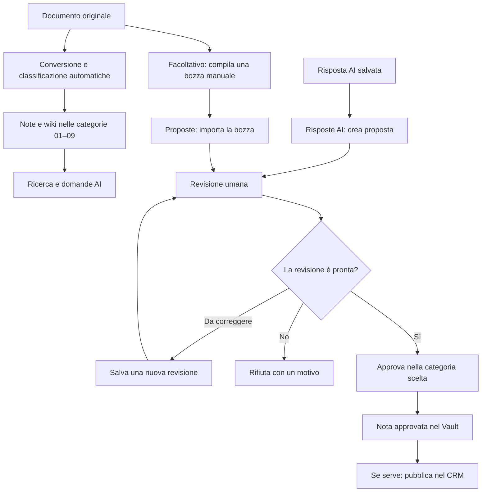
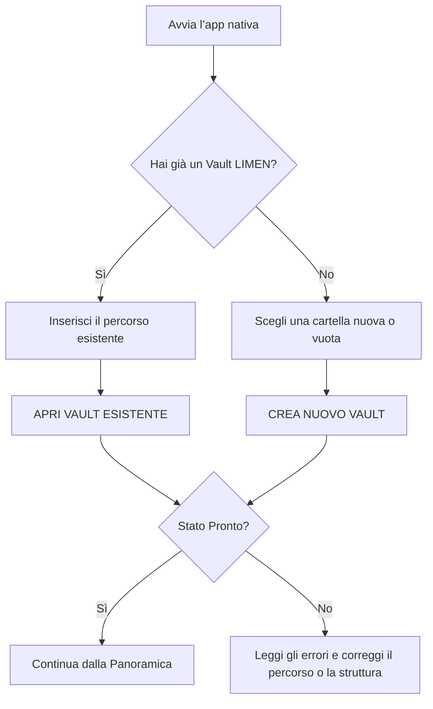
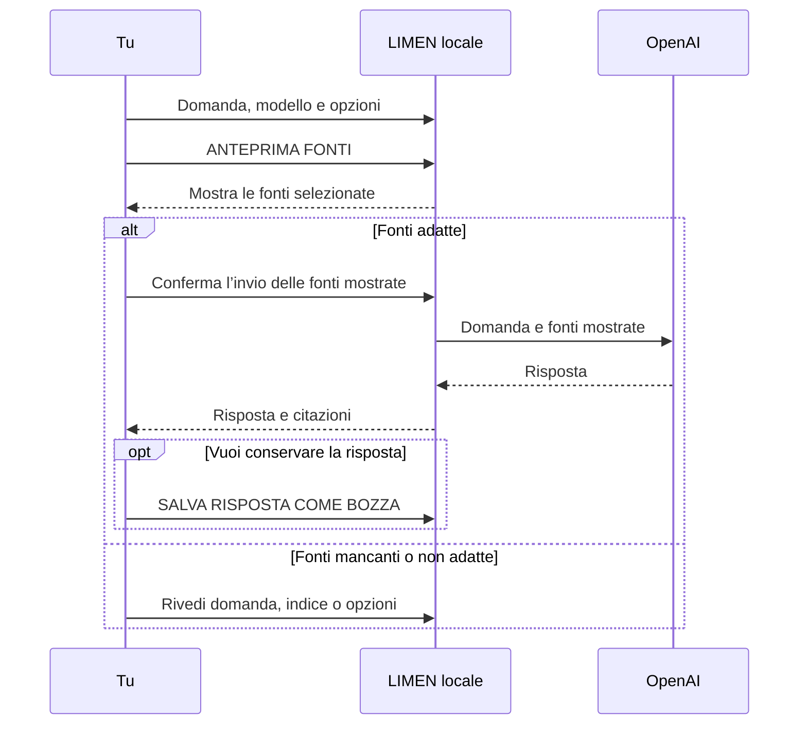
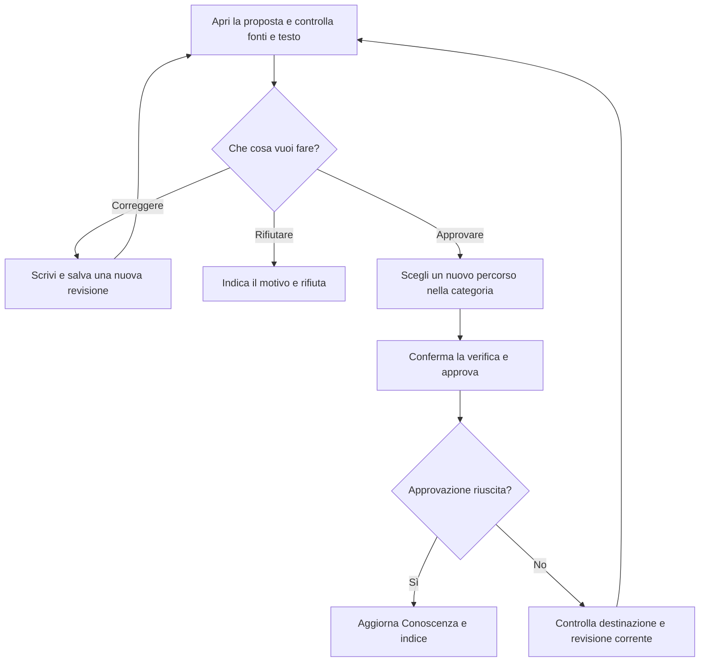
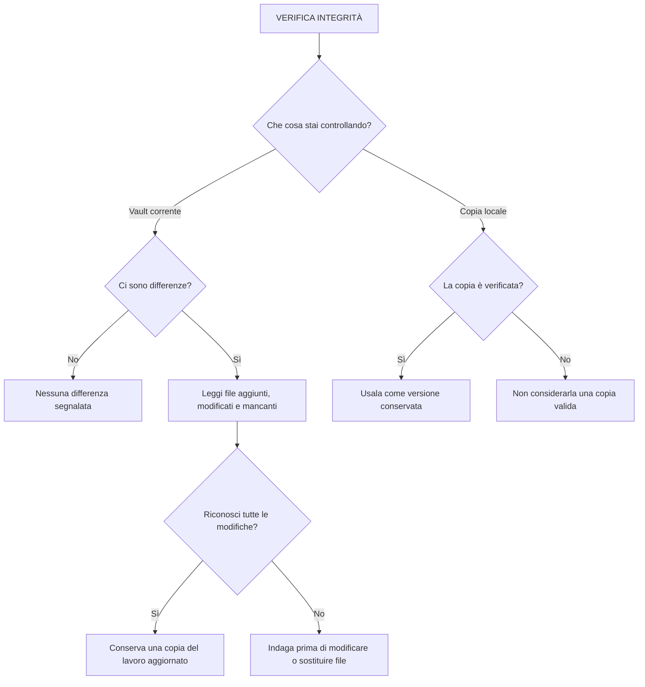
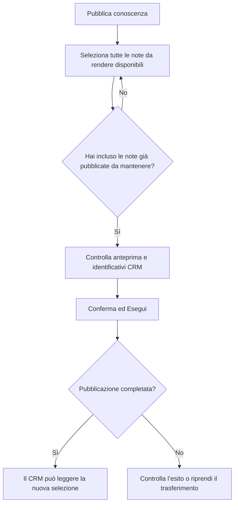
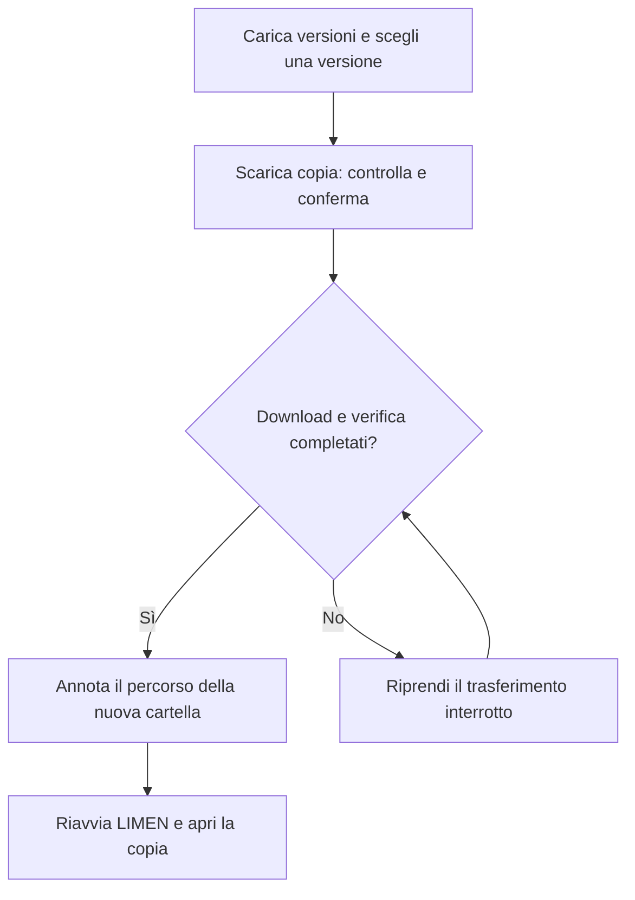
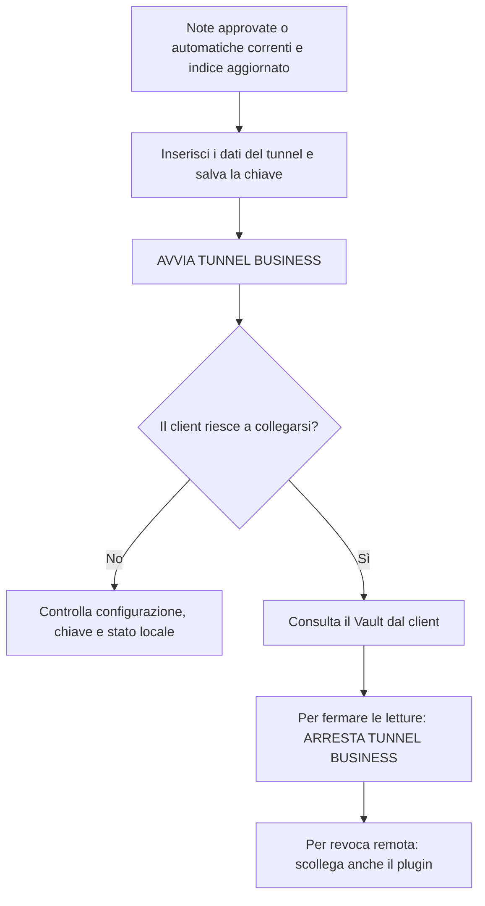

# LIMEN Vault

**La tua conoscenza, organizzata. L’AI ti aiuta. Tu decidi.**

Guida utente · macOS · Versione di riferimento **v3 (0.3.0)**  
Edizione HELP · 18 settembre 2026  
Revisione confrontata con i sorgenti locali della consegna v3

Qui trovi il percorso per iniziare, le istruzioni per ogni attività e le soluzioni ai problemi più comuni. Puoi leggere la guida dall’inizio oppure scegliere direttamente ciò che vuoi fare.

> **Prima volta?** Parti da [Primi passi](#primi-passi). Vuoi esercitarti? Segui il [Tutorial su un Vault di prova](#tutorial). Se qualcosa non funziona, vai a [Problemi e soluzioni](#problemi).

---

<a id="indice"></a>
## Trova quello che ti serve

| Voglio… | Vai a… |
| --- | --- |
| Capire come funziona LIMEN | [I concetti essenziali](#concetti) |
| Aprire o creare il mio Vault | [Primi passi](#primi-passi) |
| Sapere cosa aggiornare dopo una modifica | [La routine quotidiana](#routine) |
| Scrivere e organizzare le note | [Note e cartelle](#note) |
| Caricare documenti e ottenere note, ricerca e wiki | [Automazione dei documenti](#fonti) |
| Fare una domanda sui miei contenuti | [Chiedi al Vault](#ai) |
| Controllare e approvare una proposta | [Revisione e approvazione](#proposte) |
| Creare una copia e verificarla | [Copie locali e integrità](#copie) |
| Pubblicare nel CRM o usare il cloud | [Trasferimenti](#trasferimenti) |
| Collegare un client MCP o ChatGPT Business | [Collegamenti avanzati](#collegamenti) |
| Provare un ciclo completo senza usare dati reali | [Tutorial](#tutorial) |
| Capire una schermata o un pulsante | [Riferimento delle schermate](#schermate) |
| Risolvere un errore | [Problemi e soluzioni](#problemi) |
| Capire un termine | [Glossario](#glossario) |

**Come leggere le istruzioni.** I nomi in **grassetto** corrispondono a sezioni, pulsanti o campi dell’app. Una sequenza come **Ricerca → AGGIORNA INDICE DI RICERCA** indica dove andare e cosa premere. I testi come `01_CLIENTS` sono nomi di cartelle o valori da mantenere esattamente come sono.

---

<a id="concetti"></a>
## 1. I concetti essenziali

### Un Vault è una cartella di lavoro

Il **Vault** contiene note, documenti originali, bozze e informazioni di sistema. Rimane sul tuo Mac, separato dall’applicazione.

Carica gli originali in **LIMEN** per ottenere automaticamente note, collegamenti, indice e wiki. **Obsidian** serve per la scrittura e la modifica manuale facoltative. LIMEN permette anche domande AI, revisioni, copie e pubblicazioni.

### Quattro azioni da distinguere

| Azione | Che cosa ottieni | Dove trovi il risultato |
| --- | --- | --- |
| **Salvare una risposta AI** | Una bozza da controllare | **Risposte AI**, file in `80_AI_OUTPUTS` |
| **Approvare una proposta** | Una nota approvata nella categoria scelta | **Conoscenza**, cartelle da `01` a `10` |
| **Pubblicare conoscenza** | Una selezione di note accessibile al CRM | **Trasferimenti**, pubblicazione corrente |
| **Creare una copia** | Una versione conservata per proteggere o recuperare il lavoro | **Copie locali**, oppure copia privata cloud |

> **Da ricordare:** salvare una risposta non la approva. Approvare una nota non la pubblica. Una copia privata cloud non è una pubblicazione nel CRM.

### Il percorso di un contenuto



Il diagramma descrive il percorso delle bozze. Puoi anche scrivere direttamente una nota in Obsidian nelle cartelle di conoscenza: in quel caso sei tu a curarne contenuto e stato. Per le bozze prodotte dal compilatore o dall’AI, usa il percorso **Proposte** per conservare revisioni e decisioni.

### Quando il lavoro resta sul Mac

| Attività | Serve la rete? | Cosa viene trasferito |
| --- | --- | --- |
| Consultare note, cercare, compilare fonti, revisionare, creare copie locali | No | Nessun trasferimento richiesto da queste funzioni di LIMEN |
| Automazione documenti attivata | Sì | Testo estratto a OpenAI per classificazione e wiki; conversione/OCR locali |
| **ANTEPRIMA FONTI** | No | La preparazione delle fonti avviene in locale |
| **INVIA A OPENAI LE FONTI MOSTRATE** | Sì | La domanda e le fonti mostrate nell’anteprima |
| **Pubblica conoscenza** | Sì | Le note approvate selezionate per il CRM |
| **Carica versione** | Sì | I contenuti inclusi nel piano della copia privata, anche fonti e revisioni |
| Tunnel ChatGPT Business | Sì | Le note approvate e le note/wiki automatiche correnti lette attraverso il collegamento |

Le fonti originali in `20_RAW_SOURCES` sono escluse dalla selezione diretta di **Chiedi al Vault**. Il testo ricavato da una fonte può però entrare in una bozza o in una nota e diventare parte di un’anteprima AI. Controlla sempre le fonti mostrate prima dell’invio.

---

<a id="primi-passi"></a>
## 2. Primi passi

### Prima di iniziare

Ti servono l’app nativa LIMEN Vault e una cartella in cui tenere il Vault. Per scrivere le note ti serve Obsidian. OpenAI è necessario per classificazione e wiki automatiche; la consultazione locale e i flussi manuali restano disponibili senza AI. I collegamenti cloud sono facoltativi.

La build v3 richiede **Mac Apple Silicon con macOS 26.3 o successivo**. Per una build diversa, controlla i requisiti distribuiti con quella versione.

### Passo 1 — Apri o crea il Vault

1. Avvia **LIMEN Vault** sul Mac.
2. Nella schermata **Benvenuto in LIMEN Vault**, inserisci il **Percorso del Vault (cartella locale)**.
3. Se possiedi già un Vault LIMEN, premi **APRI VAULT ESISTENTE**.
4. Per iniziare da zero, scegli una cartella nuova o vuota e premi **CREA NUOVO VAULT**.

Esempio di percorso: `/Users/nome/Documents/LIMEN-VAULT`. Sostituisci `nome` con il nome del tuo account macOS.

**Risultato atteso:** si apre la **Panoramica** e il Vault risulta **Pronto**.

> **Attenzione:** una normale cartella di Obsidian non è necessariamente un Vault LIMEN. **CREA NUOVO VAULT** richiede una destinazione nuova o vuota e non serve a convertire una cartella piena di documenti.



Se compare **Modalità anteprima nel browser**, apri l’app nativa: l’anteprima non dispone delle operazioni sui file.

### Passo 2 — Collega Obsidian

1. Premi **Apri in Obsidian**, sotto il menu laterale o nel riepilogo.
2. Se Obsidian non conosce ancora la cartella, scegli **Open folder as vault** e seleziona il Vault appena aperto in LIMEN.
3. Torna in LIMEN e premi di nuovo **Apri in Obsidian**.

**Risultato atteso:** Obsidian apre la stessa cartella usata da LIMEN.

Se non si apre, controlla **Sistema → Applicazione Obsidian**. Lo stato atteso è **Rilevata e disponibile**.

### Passo 3 — Scrivi, aggiorna e cerca

1. In Obsidian crea una nota nella [cartella adatta](#cartelle).
2. In LIMEN apri **Conoscenza**, scegli la categoria e premi **AGGIORNA CONOSCENZA**.
3. Vai in **Ricerca** e premi **AGGIORNA INDICE DI RICERCA**.
4. Cerca una parola presente nella nota.

**Risultato atteso:** la nota compare sia in Conoscenza sia nei risultati di ricerca.

### Passo 4 — Conserva il primo risultato

Vai in **Copie locali**, inserisci una nota facoltativa, per esempio `Prima configurazione`, e premi **CREA COPIA LOCALE**. Controlla che la copia risulti **Verificata (SHA-256)**.

Per cambiare Vault, chiudi e riapri LIMEN e usa **APRI VAULT ESISTENTE**. Il campo **Cartella locale del Vault** nelle Impostazioni non è il comando per cambiare Vault.

[↑ Indice](#indice)

---

<a id="routine"></a>
## 3. La routine quotidiana

**Apri il Vault e carica gli originali: con l’automazione attiva LIMEN prepara note, indice e wiki.** Crea una copia quando vuoi conservare una versione. Pubblica nel CRM solo quando desideri rendere disponibile una selezione di note.

### Quale aggiornamento serve?

| Hai appena… | Aggiorna questa schermata | Aggiorna anche l’indice? |
| --- | --- | --- |
| Creato o modificato una nota in Obsidian | **Conoscenza → AGGIORNA CONOSCENZA** | Sì |
| Caricato o modificato un originale | **Fonti → Avanzamento e documenti** | Automatico quando il ciclo termina |
| Compilato una fonte | Apri la bozza da **Proposte** | Sì, se vuoi cercare la bozza o includerla tra le bozze indicizzate |
| Salvato una risposta AI | **Risposte AI → AGGIORNA** | Sì |
| Approvato una proposta | **Conoscenza → AGGIORNA CONOSCENZA** | Sì |
| Creato una nuova revisione | Riapri la proposta interessata | Sì, se usi contenuti non approvati nella ricerca o nell’AI |

**Aggiornare una schermata** rilegge il suo elenco. **Aggiornare l’indice** rende le modifiche disponibili alle funzioni che usano la ricerca. L’automazione aggiorna l’indice dopo le elaborazioni. Per modifiche manuali, approvazioni o automazione spenta usa **AGGIORNA INDICE DI RICERCA**.

### Cercare senza perdersi nei filtri

1. Cerca prima una parola o una parte del titolo.
2. Se i risultati sono troppi, aggiungi categoria, cliente, progetto, etichette o stato.
3. Se i risultati scompaiono, rimuovi i filtri e controlla le proprietà della nota.

Il filtro cliente cerca il valore della proprietà `client`; non ricava il cliente dal nome del file. Lo stesso principio vale per `project` e le etichette.

---

<a id="note"></a>
## 4. Note e cartelle

<a id="cartelle"></a>
### Dove mettere ogni contenuto

| Contenuto | Cartella | Valore `type` per le note |
| --- | --- | --- |
| Schede clienti | `01_CLIENTS` | `client` |
| Schede progetto | `02_PROJECTS` | `project` |
| Marchi | `03_BRANDS` | `brand` |
| Posizionamento | `04_POSITIONING` | `positioning` |
| Conoscenza sul packaging | `05_PACKAGING_KNOWLEDGE` | `packaging` |
| Metodi e checklist | `06_METHODS` | `method` |
| Casi studio | `07_CASE_STUDIES` | `case_study` |
| Ricerche di mercato | `08_MARKET_RESEARCH` | `research` |
| Concorrenti | `09_COMPETITORS` | `competitor` |
| Contenuti finali approvati | `10_APPROVED_OUTPUTS` | `approved_output` |
| Documenti originali, brief, trascrizioni | `20_RAW_SOURCES` | `raw_source`, quando si tratta di una nota con proprietà |
| Risposte AI salvate dall’app | `80_AI_OUTPUTS` | Gestito dall’app: `ai_output` |
| Bozze compilate e proposte | `90_PROPOSALS` | Gestito dall’app secondo il contenuto |
| Archivio | `99_ARCHIVE` | Non dedurre il tipo dal nome della cartella |
| File di sistema e copie locali | `00_SYSTEM` | Gestito dall’app |

Mantieni invariati i nomi delle cartelle e delle proprietà. Non tradurre `client`, `status` o i relativi valori.

Scrivi le tue note in Obsidian. Lascia all’app la gestione di `00_SYSTEM`, `80_AI_OUTPUTS` e `90_PROPOSALS`.

### Le proprietà di una nota

All’inizio di una nota puoi inserire un blocco di proprietà, chiamato **frontmatter**. È il testo compreso tra due righe `---` e permette all’app di capire titolo, tipo, stato e collegamenti della nota.

Esempio per `01_CLIENTS/cliente-demo.md`:

```markdown
---
schema_version: 1
id: cliente-demo
title: "Cliente Demo"
type: client
client: cliente-demo
status: approved
created_at: "2026-09-16T00:00:00Z"
updated_at: "2026-09-16T00:00:00Z"
tags: [demo, tutorial]
---

# Cliente Demo

Produttore di pasta secca.
Richiede packaging in carta riciclabile.
```

Questo esempio contiene dati fittizi già controllati per l’esercitazione. Per una nota reale ancora da verificare, usa `status: draft` o `status: review`. Aggiorna identificativo, titolo, date e contenuto.

| Proprietà | Serve? | Come compilarla |
| --- | --- | --- |
| `id` | Sì | Identificativo della nota, per esempio `cliente-demo` |
| `title` | Sì | Titolo leggibile |
| `type` | Sì | Tipo previsto dallo schema, coerente con il contenuto |
| `created_at`, `updated_at` | Sì | Date come testo; usa il formato dell’esempio, tra virgolette |
| `status` | Consigliata sempre | `draft`, `review`, `approved` oppure `archived` |
| `client`, `project`, `brand` | Facoltative | Identificativi collegati alla nota |
| `tags`, `source_ids` | Facoltative | Liste, per esempio `[demo, tutorial]` |
| `snapshot_id` | Facoltativa | Riferimento a una copia, quando previsto dal flusso usato |
| `schema_version` | Facoltativa | Numero intero; nell’esempio è `1` |

Tipi previsti nella documentazione: `client`, `project`, `brand`, `positioning`, `packaging`, `method`, `case_study`, `research`, `competitor`, `approved_output`, `raw_source`, `ai_output`, `proposal`.

> **Stato esplicito:** scrivi sempre `status`. Nel codice nativo, una nota senza questo campo non viene selezionata come approvata dall’AI, da MCP o dalla pubblicazione CRM. In Conoscenza può comparire come **Non specificato**. Usa `approved` solo dopo aver controllato la nota.

Una nota senza frontmatter viene accettata con un avviso, secondo la documentazione di riferimento. Un blocco presente ma non valido può impedire la validazione del Vault: ricontrolla campi, valori e sintassi indicati nell’errore.

### Se la nota deve comparire nel CRM

Le proprietà `client` e `project`, quando devono collegare la nota a un cliente o progetto del CRM, devono contenere gli **identificativi CRM esatti**. Il nome visibile non viene convertito automaticamente. Chiedi gli identificativi all’amministratore prima della pubblicazione.

**Dopo un’approvazione in Proposte:** il codice genera la nota con `client` e `project` vuoti e `tags` vuoto. Apri la nota approvata in Obsidian, compila le proprietà necessarie, poi aggiorna Conoscenza e indice. Scrivere questi dati soltanto nel corpo della proposta non compila le proprietà della nota finale.

[↑ Indice](#indice)

---

<a id="fonti"></a>
## 5. Documenti, note e wiki automatiche

### Configurazione iniziale

Apri **Impostazioni**, salva la chiave API OpenAI e verifica il Portachiavi. In **Fonti → Configurazione dell’automazione** indica un modello API disponibile nel tuo account e premi **ATTIVA AUTOMAZIONE**. L’attivazione autorizza l’invio automatico del testo estratto a OpenAI per classificazione e sintesi wiki, con consumo API. La chiave resta nel Portachiavi del Mac.

### Uso quotidiano: carica soltanto gli originali

1. Apri il Vault e vai in **Fonti**.
2. Premi **CARICA DOCUMENTI** e seleziona uno o più file nel selettore macOS. In alternativa depositali in `20_RAW_SOURCES`.
3. Lascia LIMEN aperta: controlla nuovi file e modifiche ogni 15 secondi, elabora la coda e aggiorna la ricerca. Puoi usare le altre sezioni durante il lavoro.
4. In **Avanzamento e documenti** trovi stato, errori e destinazione delle note. Consulta i risultati in **Conoscenza**, **Ricerca** e **Chiedi al Vault**.

Non servono conversione in Markdown, scelta della cartella, compilazione o approvazione manuali per ciascun documento. Chiudendo l’app il lavoro si interrompe; riaprendo lo stesso Vault riprende dalla coda salvata. Dopo **METTI IN PAUSA** non partono nuovi cicli automatici.

### Dove vengono salvati i risultati

| Contenuto | Destinazione |
| --- | --- |
| Originali integri | `20_RAW_SOURCES/` |
| Note estratte e normalizzate | Cartella pertinente da `01_CLIENTS` a `09_COMPETITORS` |
| Wiki tematiche con citazioni | Stesse categorie, raggruppate per cliente e progetto |
| Registro elaborazioni e indice | `00_SYSTEM/` |

Sono veri file `.md`, leggibili in Obsidian. I prefissi `auto-source-` e `auto-wiki-` distinguono note e wiki; il titolo leggibile compare nelle proprietà e nell’app. Cliente e progetto sono proprietà delle note: LIMEN non crea automaticamente sottocartelle per ciascuno. Se non riesce a classificare un documento usa la categoria Ricerca; i riferimenti cliente/progetto vengono accettati solo se compaiono nel testo e non sono automaticamente identificativi CRM.

I documenti lunghi vengono divisi in parti collegate da una nota indice. Note e wiki mantengono riferimenti alle fonti. Se una fonte cambia o scompare, le versioni precedenti vengono escluse dal retrieval; i file rimangono conservati. Una modifica manuale a una nota generata viene preservata e segnalata, non sovrascritta.

### Formati, privacy e limiti

- PDF testuali o scansionati; immagini PNG, JPEG, WebP, GIF, TIFF e HEIC: estrazione/OCR sul Mac.
- Word DOC/DOCX, ODT/RTF, presentazioni PPTX: estrazione sul Mac, comprese le immagini Office supportate per OCR.
- Fogli XLS/XLSX/XLSB/ODS: celle e formule estratte localmente.
- Markdown, TXT, HTML, CSV/TSV, JSON, XML, YAML ed EML: lettura locale del testo.
- OpenAI riceve il testo estratto per classificare e generare wiki. L’OCR può sbagliare caratteri; le wiki sono sintesi AI, non certificazioni umane.

Massimo 32 MB per file, PDF fino a 500 pagine, timeout OCR 180 secondi e limite del testo estratto 16 MB per Office/fogli/PDF. File corrotti o protetti, formati sconosciuti e presentazioni legacy `.ppt` vengono segnalati; non si dichiara il supporto a qualsiasi file binario.

Le note automatiche conservano `status: review` ma sono consultabili dall’AI e dai collegamenti MCP quando il registro conferma che sono aggiornate. Sono distinguibili dalle note approvate da una persona. Le altre bozze richiedono ancora l’opzione di inclusione. La pubblicazione CRM resta esplicita e richiede note approvate.

### Errori e ripresa

La coda e gli originali rimangono nel Vault se manca la connessione o la chiave. Dopo tre tentativi per revisione LIMEN interrompe i tentativi su quel documento; dopo aver risolto la causa usa **RIPROVA LE ECCEZIONI RISOLTE**. Errori di accesso API o modello mettono in pausa l’automazione: correggi la configurazione e riattivala. Non cancellare registri o note per nascondere un errore.

### Compilazione manuale facoltativa

La tabella manuale sottostante gestisce Markdown, testo e HTML. **Compila bozza** e **COMPILA TUTTE LE FONTI** creano bozze in `90_PROPOSALS` per il percorso **Proposte**. L’assenza di PDF o Word in quella tabella non significa che il caricamento automatico sia fallito: consulta **Avanzamento e documenti**.

---

<a id="ricerca-ibrida"></a>
## 5b. Ricerca Ibrida (BM25 + Semantica) e RAG 100% Locale

**Obiettivo:** ritrovare qualsiasi informazione nel Vault unendo parole esatte, concetti sinonimi e passaggi rilevanti, a costo zero e senza che alcun dato lasci il Mac.

### Come funziona il doppio motore di ricerca

Nella scheda **Chiedi**, la casella **Ricerca Ibrida** attiva la combinazione simultanea di due algoritmi:

1. **Indice Lessicale BM25 (k1=1,2, b=0,75)**:
   - Calcola la frequenza reale dei termini sia nelle note di conoscenza sia nei documenti grezzi di `20_RAW_SOURCES`.
   - Applica la normalizzazione sulla lunghezza del documento (`dl / avgdl`), evitando che i file molto estesi (es. trascrizioni lunghe centinaia di pagine) vincano arbitrariamente su documenti brevi e mirati.
   - Fornisce la massima precisione per codici progetto, nomi propri di clienti o fornitori, sigle e terminologia tecnica esatta.

2. **Vettori Semantici Locali (bge-m3, 1024 dimensioni)**:
   - I passaggi di testo (chunk da circa 1.200 caratteri) vengono vettorializzati tramite il modello integrato `bge-m3-Q8_0.gguf`.
   - Il calcolo è affidato al servizio nativo `llama-server`, eseguito direttamente sul processore Apple Silicon su socket di loopback interno (`127.0.0.1:<porta_dinamica>`).
   - Individua documenti anche quando usano parole diverse ma concetti identici (es. ricerca per *"marca privata"* che intercetta passaggi contenenti *"MDD"* o *"private label"*).

### Fusione e Classificazione dei Risultati (Formula F2)

I candidati provenienti dal canale lessicale e da quello semantico vengono unificati con coalescenza per documento (nessun duplicato in classifica). I rispettivi punteggi vengono normalizzati su scala min-max e fusi con la formula:

`Punteggio Finale = max(lessicale, semantico) + 0,20 * min(lessicale, semantico) + bonus`

- Se un documento è eccellente sia nelle parole sia nel concetto, ottiene un deciso balzo in cima alla classifica.
- Se una query contiene una frase esatta o un codice alfanumerico, viene applicato un bonus supplementare deterministico.

### Modalità Degradata (Banner Giallo)

Se il servizio semantico locale non è in esecuzione, non risponde entro il timeout o cade:
- La ricerca **non va mai in errore** e continua istantaneamente calcolando i risultati tramite l'indice lessicale BM25.
- Viene esposto il banner giallo di avviso:  
  *⚠️ Modalità degradata (solo ricerca lessicale): il servizio semantico locale non è attivo o non ha risposto. I risultati sono calcolati esclusivamente tramite indice lessicale BM25. Nessun dato è uscito dal Mac.*
- Il badge dei risultati riporta: *RAG LOCALE SPENTO (SOLO LESSICALE)*.
- **Nessun dato esce mai dal Mac**: l'applicazione non tenta alcun fallback remoto su server esterni se il fornitore configurato è locale.
- Per ripristinare il canale semantico, basta cliccare sul pulsante **Riavvia Servizio Locale** presente nell'avviso o andare in *Avanzate → Collegamenti AI & MCP*.

---

<a id="ai"></a>
## 6. Chiedi al Vault

**Obiettivo:** ottenere una risposta basata sulle fonti che hai potuto vedere prima dell’invio.

### Configurazione iniziale

1. Apri **Impostazioni → Collegamenti AI**.
2. Incolla la tua **Chiave API OpenAI** e premi **SALVA CHIAVE**.
3. Se macOS chiede accesso al Portachiavi, autorizza l’operazione.
4. Premi **VERIFICA PORTACHIAVI**.

**VERIFICA PORTACHIAVI** controlla la presenza della chiave salvata. La validità della chiave e l’accesso al modello vengono verificati quando effettui la richiesta.

### Fai una domanda

1. In **Ricerca**, premi **AGGIORNA INDICE DI RICERCA**.
2. Apri **Chiedi al Vault**.
3. Nel campo **Modello OpenAI** indica un identificativo API disponibile nel tuo account.
4. Scrivi una domanda di massimo **2.000 caratteri**. Per esempio: `Quali requisiti di packaging sono indicati per Cliente Demo? Cita le fonti.`
5. Lascia disattivata **Includi bozze indicizzate e note non approvate** per usare le note approvate e le note/wiki automatiche correnti.
6. Premi **ANTEPRIMA FONTI** e controlla i documenti mostrati.
7. Se la selezione è adatta, premi **INVIA A OPENAI LE FONTI MOSTRATE**.
8. Leggi la risposta e confronta le affermazioni importanti con le citazioni.
9. Per conservarla, premi **SALVA RISPOSTA COME BOZZA**.

**Risultato atteso:** la risposta salvata compare in **Risposte AI**, con testo, modello, fornitore e citazioni; il file si trova in `80_AI_OUTPUTS`.



### Come vengono scelte le fonti

LIMEN cerca nell’indice usando le parole della domanda e prepara automaticamente una selezione: la schermata attuale permette di ispezionarla, ma non offre caselle per scegliere o togliere singole fonti AI. Per cambiare il contesto, modifica la domanda o l’opzione sui contenuti non approvati e rigenera l’anteprima.

La selezione contiene al massimo **10 fonti** e ha un budget interno di circa **16 KB**, che comprende testo e metadati. Una nota molto lunga può essere esclusa anche se esiste nell’indice. Formula domande mirate e usa note sintetiche quando possibile.

L’opzione sui contenuti non approvati può includere anche note con `status: archived` se si trovano nelle cartelle indicizzate; non significa soltanto “includi bozze”. La cartella `99_ARCHIVE` non è tra quelle indicizzate dal motore attuale.

### Se l’anteprima non è più valida

L’anteprima dura **5 minuti** nella versione documentata. Ripeti **ANTEPRIMA FONTI** quando scade, quando una fonte cambia o quando modifichi domanda, modello o opzione sulle bozze.

Se non trovi fonti utili, controlla lo stato delle note, aggiorna l’indice e formula una domanda più mirata. Una fonte originale in RAW non entra direttamente in questa selezione.

**ANNULLA** interrompe l’attesa nell’app. Una richiesta già inviata può essere comunque elaborata dal servizio.

### Porta una risposta nel percorso di approvazione

Apri **Risposte AI → AGGIORNA**, seleziona la risposta, scegli la **Categoria** e premi **CREA PROPOSTA DALLA RISPOSTA SALVATA**. La proposta è una copia da revisionare; salvare la risposta non la rende automaticamente conoscenza approvata.

[↑ Indice](#indice)

---

<a id="proposte"></a>
## 7. Revisione e approvazione

**Obiettivo:** trasformare una bozza controllata in una nota approvata, mantenendo la storia delle revisioni.

Una proposta può arrivare da una bozza compilata in **Fonti** oppure da una risposta salvata in **Risposte AI**.

### Controlla la proposta

1. Apri **Proposte** e seleziona una voce **Da revisionare**.
2. Leggi il testo e controlla **Fonti e provenienza**.
3. Consulta la **Cronologia delle revisioni conservate**, se presente.
4. Verifica che la categoria corrisponda al contenuto che vuoi approvare.

Se devi correggere il testo, usa **Testo della nuova revisione**, confronta **Testo attuale** e **Testo proposto**, poi premi **SALVA NUOVA REVISIONE (CONSERVA LA PRECEDENTE)**. Controlla la revisione salvata prima di decidere.

### Approva

1. In **Nuova destinazione (.md)** inserisci un percorso relativo alla cartella del Vault, per esempio `01_CLIENTS/cliente-demo-brief.md`.
2. Usa la cartella della categoria scelta e un nuovo nome di file con estensione `.md`.
3. Spunta **Ho verificato questa revisione e la destinazione indicata.**
4. Premi **APPROVA REVISIONE MOSTRATA**.
5. Se servono filtri cliente/progetto, etichette o collegamenti CRM, apri la nota appena approvata in Obsidian e compila le relative proprietà.
6. Aggiorna **Conoscenza** e poi l’**indice di ricerca**.

**Risultato atteso:** una nota con `status: approved` nella cartella della categoria. La nota è ora nel Vault; la pubblicazione nel CRM rimane un’operazione separata.

### Rifiuta

Inserisci il **Motivo del rifiuto** e premi **RIFIUTA REVISIONE MOSTRATA**. Il rifiuto registra la decisione e non cancella la bozza.



Il selettore **Categoria** usa nomi al singolare, per esempio **Cliente** e **Progetto**; in **Conoscenza** trovi le corrispondenti sezioni **Clienti** e **Progetti**. Scegli la categoria prima di importare la bozza o creare la proposta: cambiarla nel selettore non riclassifica una proposta già creata.

**Testo della nuova revisione** sostituisce l’intero corpo della proposta. Inserisci il testo completo che vuoi conservare, non soltanto la frase da correggere.

### Prima di premere Approva

- Il contenuto è corretto e le fonti sostengono ciò che dice.
- La revisione mostrata è quella che vuoi approvare.
- La categoria e la destinazione sono coerenti.
- Il nome scelto non rischia di entrare in conflitto con una nota esistente.
- Se userai il CRM, hai a disposizione gli identificativi `client` e `project` da inserire nella nota approvata prima della pubblicazione.

L’approvazione rifiuta destinazioni fuori categoria, file non `.md`, destinazioni in `20_RAW_SOURCES`, collegamenti simbolici e revisioni cambiate dopo la visualizzazione. La destinazione deve essere un file che non esiste ancora: l’approvazione rifiuta un percorso già occupato, anche se il testo fosse uguale.

Se un’operazione resta interrotta, usa **RECUPERA OPERAZIONE INTERROTTA** per completare o chiudere l’operazione rimasta a metà. È disponibile anche in **Risposte AI**.

---

<a id="copie"></a>
## 8. Copie locali e integrità

### Crea una copia

1. Apri **Copie locali**.
2. Inserisci, se utile, una descrizione: `Prima della revisione del progetto`.
3. Premi **CREA COPIA LOCALE**.
4. Controlla la riga creata: ID, data, descrizione, numero di file e stato.

**Risultato atteso:** una copia **Verificata (SHA-256)** in `00_SYSTEM/SNAPSHOTS/snap-…/`.

Una copia locale è conservata sullo stesso disco del Vault. Per proteggerti anche dalla perdita del disco, conserva una copia separata, per esempio attraverso il flusso di copia privata cloud disponibile nell’app.

### Che cosa significa integrità?

LIMEN confronta i file con le impronte registrate in un elenco chiamato **manifesto**. L’impronta SHA-256 permette di rilevare cambiamenti nel contenuto dei file. Non certifica che ciò che è scritto nelle note sia corretto.

| Dove leggi lo stato | Stato | Come interpretarlo |
| --- | --- | --- |
| Panoramica del Vault | **Verificata** | La verifica non segnala differenze rispetto al manifesto usato |
| Panoramica del Vault | **Non verificata** | Non hai un esito di integrità su cui basarti |
| Panoramica del Vault | **Differenze rilevate** | Ci sono file aggiunti, modificati o mancanti da controllare |
| Elenco copie | **Verificata (SHA-256)** | La copia supera il confronto con il proprio manifesto |
| Elenco copie | **Incompleta** | Manca il manifesto della copia |
| Elenco copie | **Danneggiata** | La verifica della copia rileva un problema di integrità |

> **Una differenza non è automaticamente un danno.** Se hai aggiunto o modificato note nel Vault, le differenze possono essere attese. Controlla soprattutto i file mancanti e le modifiche che non riconosci.



Nella versione descritta **non esiste un pulsante di ripristino delle copie locali**. Il recupero cloud descritto più avanti crea invece una nuova cartella. Non sostituire manualmente il Vault corrente senza un piano di recupero verificato.

Non modificare i file dentro le copie: cambieresti proprio il contenuto che vuoi conservare. Per imparare la verifica non è necessario danneggiare una copia di prova.

[↑ Indice](#indice)

---

<a id="trasferimenti"></a>
## 9. Trasferimenti: CRM e copie cloud

### Scegli l’operazione giusta

| Il tuo obiettivo | Operazione | Risultato |
| --- | --- | --- |
| Rendere alcune note consultabili nel CRM | **Pubblica conoscenza** | Selezione di note approvate dalle cartelle `01`–`10` |
| Conservare una versione privata nel cloud | **Carica versione** | Copia con i contenuti previsti dal piano di trasferimento, inclusi fonti e revisioni |
| Recuperare una versione dal cloud | **Scarica copia** | Nuova cartella locale `LIMEN-copy-…` |
| Interrompere la disponibilità di una pubblicazione | **Ritira pubblicazione** | Ritiro dell’accesso per le successive letture CRM |
| Togliere il collegamento cloud da questo Mac | **Disconnetti** | Rimozione di configurazione e token locali |

**Disconnetti non ritira una pubblicazione.** Inoltre, ritirare una pubblicazione non elimina le copie già scaricate da altre persone.

### Collega l’archivio

Ti serve il **codice di collegamento fornito dall’amministratore**.

1. Apri **Trasferimenti → Impostazioni Copia cloud**.
2. Incolla il codice completo nel campo dedicato.
3. Premi **Collega archivio**.
4. Premi **Test Connessione** e controlla l’esito **Collegamento verificato**.

Il codice è un testo strutturato JSON con `endpoint` e `token`. Non ricostruirlo a mano e non condividerlo nelle note. Se viene rifiutato, chiedi all’amministratore di verificarlo.

**Test Connessione** controlla il collegamento senza inviare i contenuti del Vault. Il campo **Bucket R2 di destinazione** è in sola lettura.

### Pubblica nel CRM

1. Apri **Trasferimenti → Operazioni Trasferimento**.
2. Scegli **Pubblica conoscenza**.
3. Seleziona le note approvate da rendere disponibili.
4. Controlla l’anteprima, inclusi cliente e progetto quando usati.
5. Premi **Conferma ed Esegui**.
6. Attendi il completamento e verifica che la pubblicazione sia disponibile nel CRM.

> **La selezione è completa, non incrementale.** Ogni nuova pubblicazione sostituisce la selezione precedente. Includi sia le note nuove sia quelle già pubblicate che vuoi mantenere disponibili.

**Esempio:** ieri hai pubblicato A e B. Oggi vuoi aggiungere C mantenendo le altre: seleziona **A, B e C**. Se selezioni soltanto C, la nuova pubblicazione contiene soltanto C.



### Carica una copia privata

Scegli **Carica versione**, controlla il piano e gli elementi esclusi, poi premi **Conferma ed Esegui**. Questa operazione serve a conservare una versione; non rende il suo contenuto leggibile al CRM.

### Recupera una copia

1. In **Versioni precedenti da recuperare**, premi **Carica versioni**.
2. Scegli la versione desiderata, aiutandoti con data e numero di file.
3. Premi **Scarica copia**, controlla l’anteprima e conferma.
4. Attendi il completamento e annota il percorso indicato da **Copia salvata**.
5. Riavvia LIMEN e usa **APRI VAULT ESISTENTE** su quella nuova cartella.

**Risultato atteso:** una cartella `LIMEN-copy-…` accanto al Vault. Il recupero non sostituisce il Vault aperto.



Non aprire come Vault una cartella temporanea di download incompleto.

### Interruzioni, conflitti e ritiro

| Situazione | Cosa fare |
| --- | --- |
| Vuoi fermare un trasferimento | Premi **Annulla trasferimento**. L’arresto avviene dopo la richiesta in corso |
| Rete persa o app chiusa durante il trasferimento | Riapri **Trasferimenti** e usa **Riprendi trasferimento interrotto** |
| Stato **Conflitto** | Ricarica l’anteprima, controlla il nuovo piano e conferma di nuovo |
| Vuoi ritirare il contenuto dal CRM | **Ritira pubblicazione → Conferma ritiro** |
| Hai aperto per errore la conferma di ritiro | Premi **Mantieni pubblicazione** |

Il protocollo riportato nella documentazione prevede **1.000 documenti per versione**, **8 MiB per file** e **256 MiB totali**. Se un piano supera i limiti, riduci il contenuto secondo l’esito mostrato dall’app.

---

<a id="collegamenti"></a>
## 10. Collegamenti avanzati

Queste funzioni sono facoltative. Puoi usare il Vault, la ricerca e le copie locali senza configurarle.

### MCP locale: consulta il Vault da un altro client

MCP permette a un client compatibile di consultare il Vault. Gli strumenti descritti per LIMEN sono `list_vaults`, `search_vault` e `read_document`: operano in sola lettura sulle note approvate e sulle note/wiki automatiche correnti e indicizzate.

1. Aggiorna l’indice di ricerca.
2. Apri **Impostazioni → MCP in sola lettura · Vault corrente**.
3. Premi **ATTIVA MCP LOCALE**.
4. Copia nel client compatibile l’indirizzo locale, l’ID del Vault e il token richiesti dalla sua configurazione.
5. Al termine, premi **REVOCA MCP** se vuoi fermare il collegamento e invalidare il token.

L’indirizzo ha la forma `http://127.0.0.1:<porta>/mcp`: è un endpoint locale del Mac. Il token va mantenuto riservato. Il riavvio dell’app spegne MCP; dopo una nuova attivazione aggiorna i dati del collegamento nel client.

### Client con trasporto stdio

La documentazione descrive anche un avvio del binario `limen-vault` con due argomenti: `--mcp-stdio` e il percorso assoluto del Vault. Questa modalità viene avviata dal client ed è distinta dall’endpoint HTTP attivato nelle Impostazioni.

Per configurarla servono il percorso effettivo del binario nella tua installazione e le istruzioni del client. Non copiare un percorso ipotetico. Per disattivarla, rimuovi la configurazione dal client e termina l’eventuale processo ancora attivo.

### ChatGPT Business: tunnel privato

Questa funzione è disponibile anche nella v3. Usala se la configurazione prevista è disponibile nel tuo ambiente e hai ricevuto i dati necessari.

1. Controlla l’indice e le note approvate o automatiche correnti disponibili.
2. In **Impostazioni → ChatGPT Business · tunnel privato**, inserisci **ID tunnel**, **ID organizzazione** e **Chiave di esecuzione del tunnel**.
3. Premi **SALVA CHIAVE TUNNEL**.
4. Premi **AVVIA TUNNEL BUSINESS** e verifica il collegamento dal client ChatGPT.
5. Lascia il Mac e LIMEN accesi durante l’utilizzo.
6. Per fermare le nuove letture premi **ARRESTA TUNNEL BUSINESS**. Per revocare anche il collegamento remoto, scollega il plugin in ChatGPT.



Il tunnel non parte automaticamente all’apertura di LIMEN e si arresta alla chiusura dell’app.

### Motore Semantico Locale (bge-m3) e Gestione Cache

Nel pannello **Avanzate → Collegamenti AI & MCP → Motore semantico**:
- **Scelta del Fornitore**: puoi commutare liberamente tra *Locale (bge-m3, nessun dato esce dal Mac)* e *OpenAI (in rete)*. Nessun URL viene digitato a mano: l'endpoint loopback viene gestito dinamicamente dal prodotto.
- **Gestione del Modello**: scarica il file `bge-m3-Q8_0.gguf` (~605 MB) con verifica automatica del checksum crittografico SHA-256 (`950f4a8e5e19477a...`) oppure seleziona un file `.gguf` locale.
- **Ciclo di Vita del Servizio**: gestisci l'avvio, l'arresto e il controllo di salute del processo integrato `llama-server`. Il sistema alloca a ogni avvio una porta libera loopback (`127.0.0.1:<porta>`), verifica `/health` ed esegue l'arresto pulito alla chiusura dell'applicazione. In caso di errore, lo stderr viene salvato in `~/Library/Application Support/LIMEN Vault/models/llama-server.log`.
- **Cache Semantica a Staging**: l'allineamento della cache vettoriale a 1024 dimensioni avviene tramite file di staging atomico `00_SYSTEM/EMBEDDINGS_CACHE.staging.json`, garantendo la massima sicurezza dei dati e la riprendibilità immediata del calcolo in caso di interruzione.

[↑ Indice](#indice)

---

<a id="tutorial"></a>
## 11. Tutorial: un giro completo con dati fittizi

**Prova del flusso automatico:** crea un Vault di prova, configura chiave e modello, attiva l’automazione e carica un PDF o DOCX privo di dati sensibili. Attendi documenti pronti e pagine wiki; consulta la categoria e cerca una frase della fonte. Verifica che l’originale sia conservato in RAW.

Le lezioni seguenti descrivono invece il percorso manuale facoltativo: creare una nota, compilare una bozza, approvarla e conservarne una copia.

Usa una cartella di prova nuova, per esempio `/Users/nome/Documents/LIMEN-PROVA`. Non usare il Vault con cui lavori ogni giorno.

### Tappa 1 — Crea il Vault e aprilo in Obsidian

Segui [Primi passi](#primi-passi) e premi **CREA NUOVO VAULT** sul percorso di prova.

**Controllo:** stato **Pronto**. Per un Vault appena creato, la documentazione indica 15 cartelle, due file Markdown di sistema (`HOME.md`, `VAULT_RULES.md`) e `VAULT_MANIFEST.json` in `00_SYSTEM`. I contatori iniziali attesi sono **File Markdown: 2**, **Fonti originali: 0**, **File delle proposte: 0**.

### Tappa 2 — Crea e ritrova la prima nota

1. In Obsidian crea `01_CLIENTS/cliente-demo.md` usando l’[esempio completo](#note).
2. In LIMEN apri **Conoscenza → Clienti → AGGIORNA CONOSCENZA**.
3. Apri **Ricerca → AGGIORNA INDICE DI RICERCA** e cerca `pasta`.
4. Prova il filtro cliente `cliente-demo` e l’etichetta `demo`.

**Controllo:** la nota è visibile e la ricerca la trova. Se togli i filtri, deve essere ancora rintracciabile con una parola del testo.

### Tappa 3 — Prepara un documento originale

Dal Finder crea un file di testo chiamato `brief-demo.txt` dentro `20_RAW_SOURCES`, con questo contenuto fittizio:

```text
Cliente Demo — aggiornamento del brief
Il cliente richiede packaging in carta riciclabile.
La proposta grafica deve lasciare ben visibili nome prodotto e tempo di cottura.
Prima della consegna, verificare le informazioni con il referente del progetto.
```

In **Fonti**, aggiorna l’elenco e premi **Compila bozza** sulla riga del file.

**Controllo:** la fonte risulta **Compilata** e una bozza è disponibile per l’importazione. Il riepilogo aggregato compare quando usi **COMPILA TUTTE LE FONTI**.

### Tappa 4 — Revisiona e approva

1. In **Proposte**, apri **Importa una bozza compilata da revisionare**.
2. Nel selettore **Categoria** scegli **Cliente**, poi apri la bozza e premi **IMPORTA BOZZA MOSTRATA**.
3. Leggi testo e provenienza. Se vuoi esercitarti, salva una nuova revisione con una piccola correzione.
4. Come destinazione usa `01_CLIENTS/cliente-demo-brief.md`.
5. Spunta la conferma e premi **APPROVA REVISIONE MOSTRATA**.
6. In Obsidian apri la nota approvata e imposta `client: cliente-demo` se vuoi ritrovarla con il filtro cliente; le proprietà cliente e progetto generate dall’approvazione sono inizialmente vuote.
7. Aggiorna Conoscenza e indice.

**Controllo:** la nuova nota è in **Conoscenza → Clienti**. La fonte originale è ancora disponibile. Nessuna pubblicazione CRM è stata eseguita da questi passaggi.

### Tappa 5 — Conserva la prova

In **Copie locali**, inserisci `Tutorial completato` e premi **CREA COPIA LOCALE**.

**Controllo:** la copia è **Verificata (SHA-256)**. Puoi usare **VERIFICA INTEGRITÀ** senza modificare i file della copia.

### Tappa facoltativa A — Chiedi all’AI

Se hai configurato la chiave API, segui [Chiedi al Vault](#ai) con questa domanda: `Quali requisiti di packaging sono indicati per Cliente Demo?`

Controlla le fonti prima di inviare. Salva la risposta, aprila in **Risposte AI** e crea una proposta. Se la approvi, scegli un nome nuovo, per esempio `01_CLIENTS/cliente-demo-sintesi.md`.

### Tappa facoltativa B — Prova il cloud

Esegui questa tappa solo con un codice valido e una destinazione che l’amministratore abbia indicato come adatta ai test. Pubblicare rende disponibili le note al CRM collegato: evita di inserire dati dimostrativi nell’ambiente operativo.

Segui [Trasferimenti](#trasferimenti) per caricare una copia privata e scaricarla in una nuova cartella. Se è previsto anche un test CRM, verifica la selezione completa prima della conferma.

### Termina il tutorial

Chiudi e riapri LIMEN, poi apri il tuo Vault di lavoro con **APRI VAULT ESISTENTE**. Puoi rimuovere il Vault di prova dall’elenco di Obsidian; questo non elimina la cartella dal disco. Eliminala dal Finder solo quando non ti serve più.

---

<a id="schermate"></a>
## 12. Riferimento delle schermate

Le dodici sezioni del menu laterale includono **Guida & Aiuto**, prima di Impostazioni.

| Schermata | A cosa serve | Controlli principali |
| --- | --- | --- |
| **Panoramica** | Vedere stato, contatori e differenze di integrità | Accessi alla Conoscenza e a **Chiedi al Vault** |
| **Chiedi al Vault** | Fare domande con anteprima delle fonti | **ANTEPRIMA FONTI**, invio, **ANNULLA**, salvataggio bozza |
| **Conoscenza** | Leggere le note per categoria | Categorie, **AGGIORNA CONOSCENZA** |
| **Fonti** | Caricare originali e creare note/wiki automaticamente | **CARICA DOCUMENTI**, **ATTIVA AUTOMAZIONE**, stato e riprova |
| **Guida & Aiuto** | Consultare le istruzioni integrate | Ricerca e capitoli |
| **Ricerca** | Cercare nell’indice locale | **AGGIORNA INDICE DI RICERCA**, testo e filtri |
| **Risposte AI** | Consultare risposte salvate e creare proposte | **AGGIORNA**, categoria, creazione proposta, recupero operazione |
| **Proposte** | Importare, correggere, approvare o rifiutare | Importazione, revisioni, destinazione, approvazione e rifiuto |
| **Copie locali** | Conservare e verificare copie del Vault | **CREA COPIA LOCALE**, **VERIFICA INTEGRITÀ** |
| **Trasferimenti** | Pubblicare, caricare versioni e recuperare copie | Operazioni e impostazioni cloud |
| **Sistema** | Controllare ambiente locale e presenza di Obsidian | Tabella **Stato del sistema locale** |
| **Impostazioni** | Gestire chiavi e collegamenti | OpenAI, MCP locale, tunnel Business, percorso del Vault |

### Panoramica: leggi correttamente i contatori

| Indicatore | Che cosa significa |
| --- | --- |
| **File Markdown** | File `.md` del Vault, compresi quelli di sistema; copie in `SNAPSHOTS` escluse |
| **Fonti originali** | Documenti in `20_RAW_SOURCES` |
| **File delle proposte** | File di bozze e revisioni; non è il numero delle sole decisioni in attesa |
| **Integrità SHA-256** | Esito del confronto con il manifesto: verificata, non verificata o differenze |

Lo stato **Pronto** indica una struttura valida. Integrità dei file e disponibilità nel CRM sono verifiche distinte.

Gli accessi rapidi alle categorie aprono **Conoscenza**; nella versione descritta devi poi scegliere la categoria nella barra in alto.

### Conoscenza e Ricerca

**Conoscenza** legge i file direttamente in sola lettura, senza passare dall’indice. Le dieci categorie corrispondono alle cartelle da `01_CLIENTS` a `10_APPROVED_OUTPUTS`; la categoria del packaging si chiama **Confezionamento** nell’interfaccia.

Se compare **Nessuna nota Markdown in questa categoria.**, verifica cartella ed estensione `.md`. La lettura di categoria accetta al massimo **1.000 note**, **512 KiB per nota** e **8 MiB complessivi**. Questi limiti sono distinti da quelli del trasferimento cloud.

**Ricerca** mostra titolo, categoria, rilevanza, percorso ed estratto. Lo **Stato indice** riporta numero di documenti e data dell’indicizzazione. I filtri disponibili riguardano categoria, cliente, progetto, etichette separate da virgole e stato: **Approvata**, **Bozza**, **In revisione**, **Archiviata**.

### Sistema e Impostazioni

La tabella **Stato del sistema locale** mostra cartella del Vault, Obsidian, motore delle copie, ambiente di esecuzione e servizi remoti.

La riga **Servizi remoti** è descrittiva: non è una prova di connessione al CRM o al cloud. Per controllare l’archivio usa **Trasferimenti → Test Connessione**.

In **Impostazioni**:

- **RIMUOVI CHIAVE** elimina dal Portachiavi la chiave OpenAI usata da LIMEN.
- **Mostra il token di collegamento — mantienilo riservato** rivela il token MCP.
- **Cartella locale del Vault** mostra il percorso in uso. Nella versione documentata modificarne il testo cambia il percorso in uso nello stato dell’interfaccia senza validarlo né spostare file, e interrompe i collegamenti attivi. Non usarlo per cambiare Vault: riavvia l’app.

Le sigle **M6**, **M3** e **M10**, quando presenti vicino alle sezioni, sono riferimenti interni di sviluppo; non sono errori o stati del Vault.

### Menu nativi macOS

Il codice localizza i menu standard **File**, **Modifica**, **Vista**, **Finestra** e **Aiuto**, oltre alle voci dell’app. I comandi come **Annulla**, **Ripeti**, **Copia** e **Incolla** riguardano l’editing del testo: non sono un annullamento di approvazioni o pubblicazioni. La presenza del menu **Aiuto** non implica che questa guida sia già collegata nell’app.

### Stati del Vault e del cloud

| Stato del Vault | Significato | Azione utile |
| --- | --- | --- |
| `NO_VAULT` | Nessun Vault selezionato | Apri o crea un Vault |
| `NOT_ACCESSIBLE` | Cartella non raggiungibile o non leggibile | Controlla percorso e accesso |
| `INCOMPLETE` | Manca una cartella obbligatoria | Leggi il dettaglio della struttura mancante |
| `INVALID` | Problema nei file di sistema, manifesto, proprietà o collegamenti simbolici | Correggi il problema indicato, senza cancellazioni alla cieca |
| `READY` / **Pronto** | Struttura valida | Continua il lavoro |

Il cloud può mostrare **Pronto**, **Non configurato**, **Non connesso**, **Disattivato**, **Verifica in corso**, **Autenticazione richiesta**, **Trasferimento in corso**, **Non riuscito**, **Conflitto**, **Collegamento in corso**, **Scaduto** o **Revocato**. Leggi sempre il dettaglio dell’esito; per credenziali scadute o revocate chiedi all’amministratore un collegamento valido.

[↑ Indice](#indice)

---

<a id="problemi"></a>
## 13. Problemi e soluzioni

### Parti dal sintomo

| Cosa succede | Primo controllo | Come procedere |
| --- | --- | --- |
| Il Vault non si apre | Percorso della cartella e dettaglio della validazione | Verifica che sia un Vault LIMEN completo, non una generica cartella Obsidian |
| **CREA NUOVO VAULT** viene rifiutato | Destinazione già occupata | Scegli una cartella nuova o vuota |
| La creazione si è interrotta a metà | Cartella con file parziali | Conserva il dettaglio dell’errore; per una nuova prova scegli un’altra cartella |
| Una nota non compare in Conoscenza | Cartella, categoria ed estensione `.md` | Premi **AGGIORNA CONOSCENZA** |
| La nota compare in Conoscenza ma non in Ricerca | Data dell’indice e filtri | Aggiorna l’indice e prova senza filtri |
| Il filtro cliente o progetto non trova la nota | Proprietà `client` o `project` | Inserisci il valore corretto nella nota e aggiorna l’indice |
| La compilazione manuale non gestisce PDF/Word | Stai usando gli strumenti manuali | Usa **CARICA DOCUMENTI** e attiva l’automazione |
| Automazione ferma o errore | Stato in **Avanzamento e documenti**, chiave, modello e rete | Risolvi la causa; riattiva o riprova le eccezioni |
| L’invio AI è disabilitato | Anteprima e presenza di fonti utilizzabili | Controlla note e stato, aggiorna l’indice, genera una nuova anteprima |
| OpenAI non risponde | Dettaglio dell’errore, rete, chiave e modello | Correggi la causa indicata; le attività locali restano disponibili |
| L’approvazione viene respinta | Categoria, nome del file e revisione corrente | Usa una destinazione valida e riapri la proposta |
| Panoramica mostra **Differenze rilevate** | Elenco dei file aggiunti, modificati e mancanti | Distingui le tue modifiche da cambiamenti inattesi |
| Una copia è **Danneggiata** o **Incompleta** | Esito di integrità | Non usarla come copia valida; controlla il Vault prima di creare una nuova copia |
| Vuoi cambiare Vault | Sei nelle Impostazioni | Riavvia LIMEN e usa **APRI VAULT ESISTENTE** |
| Il cloud è **Non configurato** | Codice di collegamento mancante | Richiedilo all’amministratore e collega l’archivio |
| Un trasferimento è interrotto | Esito dell’ultima operazione | Usa **Riprendi trasferimento interrotto** |
| Compare **Conflitto** | Versione remota cambiata | Ricarica l’anteprima e riconferma il piano aggiornato |
| Il CRM mostra `NO_PUBLICATION` | Nessuna pubblicazione disponibile | Controlla il completamento di **Pubblica conoscenza** |
| Il CRM non mostra una nota attesa | Selezione dell’ultima pubblicazione e identificativi CRM | Includi la nota nella selezione completa e verifica `client` / `project` |
| MCP non risponde dopo un riavvio | Endpoint locale spento | Riattiva MCP e aggiorna il token nel client |
| Obsidian non si apre | **Sistema → Applicazione Obsidian** | Controlla installazione e registrazione della cartella come Vault |

### Messaggi dell’app

I testi con i puntini indicano l’inizio del messaggio: il dettaglio completo può aggiungere informazioni utili.

| Messaggio | Significato pratico | Cosa fare |
| --- | --- | --- |
| **Configura la chiave API nelle Impostazioni.** | Manca una chiave salvata | Inserisci la chiave e premi **SALVA CHIAVE** |
| **Indica un modello API disponibile nel tuo account.** | Manca il modello | Compila **Modello OpenAI** |
| **Il formato della chiave API non è valido.** | Il testo della chiave non è accettato | Ricopia la chiave completa nel campo corretto |
| **Accesso al Portachiavi negato o non disponibile.** | L’app non riesce a usare il Portachiavi | Riprova e controlla l’autorizzazione macOS |
| **Impossibile rimuovere la chiave dal Portachiavi.** | La rimozione non è riuscita | Controlla la voce in Accesso Portachiavi |
| **ID del tunnel o dell’organizzazione non valido.** | I dati Business non sono accettati | Ricontrolla gli ID forniti per la configurazione |
| **Salva la chiave del tunnel nelle Impostazioni.** | Manca la chiave del tunnel | Premi **SALVA CHIAVE TUNNEL** dopo averla inserita |
| **Accesso alla chiave del tunnel nel Portachiavi negato.** | L’accesso alla chiave è stato negato | Controlla e autorizza la richiesta macOS |
| **Il Vault non ha superato la validazione.** | C’è un problema nella struttura o nei file | Leggi e correggi gli errori elencati |
| **Il percorso del Vault non indica una cartella.** | Il percorso non punta alla cartella richiesta | Seleziona la cartella del Vault |
| **Anteprima scaduta. Seleziona nuovamente le fonti.** | L’anteprima ha superato il tempo valido | Premi di nuovo **ANTEPRIMA FONTI** |
| **Anteprima scaduta o nessuna fonte utilizzabile…** | L’anteprima non è più utilizzabile | Aggiorna l’indice e controlla le note disponibili |
| **È già in corso una richiesta AI.** | È stato tentato un secondo invio | Attendi oppure premi **ANNULLA** |
| **Una fonte è cambiata dopo l’anteprima…** | Il contenuto mostrato non è più quello corrente | Genera una nuova anteprima |
| **Richiesta annullata.** | L’attesa è stata annullata | Riparti con una nuova richiesta, se necessario |
| **Accesso al documento negato.** | Il percorso non è consentito | Apri il documento dal suo elenco nell’app |
| **La nota è cambiata durante la lettura…** | Il file è stato modificato nel frattempo | Aggiorna la schermata e riaprilo |
| **L’anteprima della categoria supera il limite di 8 MiB.** | La categoria supera il limite di anteprima | Consulta le note tramite Ricerca o Obsidian |
| **Operazione non completata. Consulta il dettaglio tecnico…** | Serve il messaggio tecnico per capire la causa | Conserva il dettaglio e l’azione che stavi eseguendo |

### Evita di peggiorare un errore

Non cancellare file di sistema, registri di operazione o cartelle temporanee per far sparire un messaggio. Non usare spostamenti manuali delle bozze per saltare la revisione. Se l’indice viene segnalato come danneggiato, conserva il dettaglio: la documentazione indica che l’app lo mantiene invece di azzerarlo.

Per chiedere assistenza prepara: versione di LIMEN, sezione aperta, azione tentata, messaggio completo e risultato atteso. Rimuovi chiavi, token, codici di collegamento e contenuti riservati da ciò che condividi.

### Domande frequenti

**Posso lavorare senza AI?**  
Sì. Note, ricerca, compilazione locale, revisione e copie locali non richiedono una richiesta AI.

**Perché Conoscenza vede una nota e l’AI no?**  
Conoscenza legge i file; la selezione AI usa contenuti indicizzati. Aggiorna l’indice e controlla lo stato della nota e l’opzione sulle bozze.

**Una risposta con citazioni è già approvata?**  
No. Le citazioni ti aiutano a controllarla. La revisione e l’approvazione restano una tua decisione.

**Posso sovrascrivere una nota approvata con una proposta?**  
Il flusso richiede una destinazione nuova e rifiuta qualsiasi file già esistente. Per correggere direttamente una nota esistente usa Obsidian, poi aggiorna Conoscenza e indice. Il testo fornito non documenta una procedura di sostituzione tramite Proposte.

**Carica versione pubblica tutto nel CRM?**  
No. Crea una copia privata. Per il CRM usa **Pubblica conoscenza**.

**Se tolgo l’app perdo il Vault?**  
Il Vault è una cartella separata. La documentazione indica che la rimozione dell’app non elimina il Vault né le chiavi nel Portachiavi.

**Come aggiorno LIMEN?**  
Conserva una copia del lavoro, arresta l’eventuale tunnel e chiudi LIMEN. Segui le istruzioni dell’installer della nuova versione, poi riapri il Vault esistente e controlla lo stato **Pronto**. Non aggirare i controlli di sicurezza macOS per completare l’installazione.

[↑ Indice](#indice)

---

<a id="glossario"></a>
## 14. Glossario essenziale

| Termine | Significato |
| --- | --- |
| **Vault** | Cartella con la struttura LIMEN e i tuoi contenuti |
| **Markdown** | Formato di testo delle note, normalmente con estensione `.md` |
| **Frontmatter** | Proprietà della nota, nel blocco YAML iniziale delimitato da `---` |
| **Fonte originale / RAW** | Documento conservato in `20_RAW_SOURCES`; il compilatore ne mantiene l’originale |
| **Compilazione** | Elaborazione locale di una fonte supportata per creare una bozza |
| **Bozza** | Contenuto ancora da controllare; salvarlo non equivale ad approvarlo |
| **Proposta** | Contenuto inserito nel percorso di revisione e decisione |
| **Revisione** | Una versione della proposta; salvarne una nuova conserva la precedente |
| **Approvazione** | Decisione che scrive la revisione nella categoria scelta con stato `approved` |
| **Indice** | Archivio locale usato dalla ricerca; deve essere aggiornato dopo le modifiche |
| **Provenienza** | Informazioni che permettono di risalire all’origine di un contenuto |
| **Manifesto** | Elenco dei file e delle loro impronte di integrità |
| **SHA-256** | Impronta usata per rilevare cambiamenti nel contenuto dei file |
| **Snapshot / copia locale** | Versione conservata nel Vault, dentro `00_SYSTEM/SNAPSHOTS` |
| **Pubblicazione** | Selezione corrente di note approvate disponibile al CRM |
| **Copia privata cloud** | Versione conservata nel cloud attraverso un flusso distinto dalla pubblicazione CRM |
| **CRM** | Sistema collegato che può consultare la conoscenza pubblicata |
| **Portachiavi** | Archivio macOS usato da LIMEN per chiavi e token |
| **Token** | Credenziale di accesso a un collegamento; va mantenuta riservata |
| **MCP** | Protocollo con cui un client compatibile consulta gli strumenti esposti da LIMEN |
| **Tunnel Business** | Collegamento descritto dall’app per la consultazione da ChatGPT Business |
| **R2** | Servizio di archiviazione cloud utilizzato dal sistema di trasferimento descritto |

---

<a id="note-edizione"></a>
## 15. Edizione v3 e verifica della documentazione

Questa guida descrive il codice locale v3 (0.3.0), aggiornato il 18 settembre 2026. HELP integrato, file HELP, guida e manuale distribuito descrivono lo stesso flusso automatico. Il pacchetto include i documenti anche per la lettura offline.

L’automazione è verificata nei moduli `automation.rs`, `extraction.rs`, `AutomationPanel.tsx`; le regole di lettura in `ai.rs`, `mcp.rs` e nei componenti di ricerca. La compilazione manuale resta in `compiler.rs`, la pubblicazione in `sync.rs`. Firma e notarizzazione attestano il pacchetto; non certificano la correttezza dei contenuti generati dall’AI. Gli esiti dei collaudi e gli eventuali residui sono registrati separatamente nella checklist di progetto.
